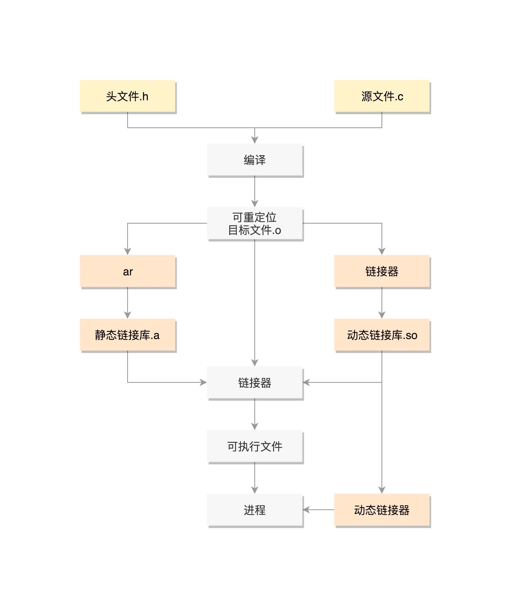
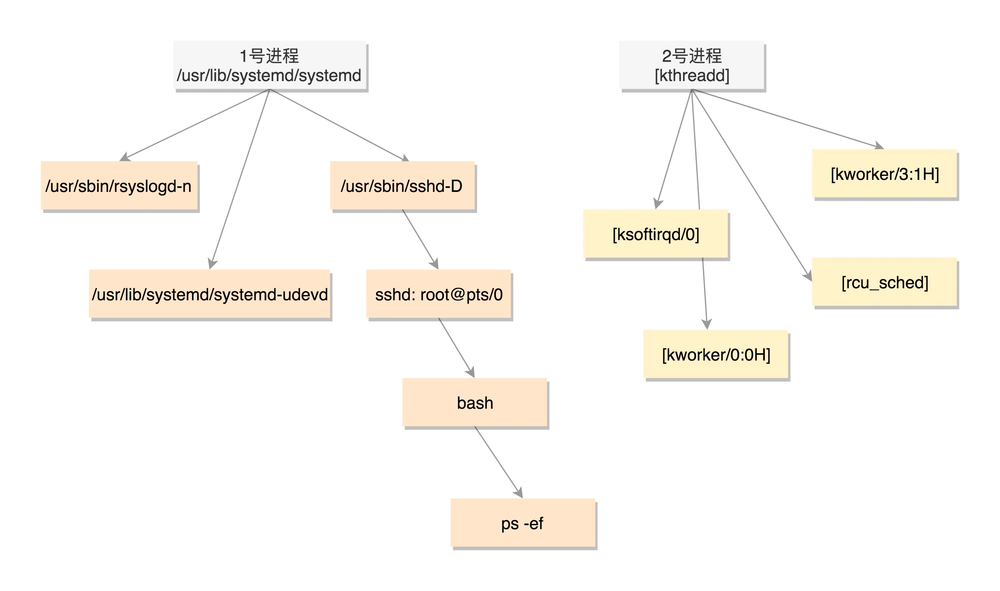

    #include <stdio.h>
    #include <stdlib.h>
    #include <sys/types.h>
    #include <unistd.h>
    
    
    extern int create_process (char* program, char** arg_list);
    
    
    int create_process (char* program, char** arg_list)
    {
        pid_t child_pid;
        child_pid = fork ();
        if (child_pid != 0)
            return child_pid;
        else {
            execvp (program, arg_list);
            abort ();
        }
}

运行ls命令的 c 代码：

#include <stdio.h>
#include <stdlib.h>
#include <sys/types.h>
#include <unistd.h>

extern int create_process (char* program, char** arg_list);

int main ()
{
char* arg_list[] = {
"ls",
"-l",
"/etc/yum.repos.d/",
NULL
};
create_process ("ls", arg_list);
return 0;
}

在 Linux 下面，二进制的程序也要有严格的格式，这个格式我们称为 ELF（Executeable and Linkable Format，可执行与可链接格式）

exec 比较特殊，它是一组函数：
包含 p 的函数（execvp, execlp）会在 PATH 路径下面寻找程序；
不包含 p 的函数需要输入程序的全路径；
包含 v 的函数（execv, execvp, execve）以数组的形式接收参数；
包含 l 的函数（execl, execlp, execle）以列表的形式接收参数；
包含 e 的函数（execve, execle）以数组的形式接收环境变量。

既然所有的进程都是从父进程 fork 过来的，那总归有一个祖宗进程，这就是咱们系统启动的 init 进程。

[root@deployer ~]# ps -ef
UID        PID  PPID  C STIME TTY          TIME CMD
root         1     0  0  2018 ?        00:00:29 /usr/lib/systemd/systemd --system --deserialize 21
root         2     0  0  2018 ?        00:00:00 [kthreadd]
root         3     2  0  2018 ?        00:00:00 [ksoftirqd/0]
root         5     2  0  2018 ?        00:00:00 [kworker/0:0H]
root         9     2  0  2018 ?        00:00:40 [rcu_sched]
......
root       337     2  0  2018 ?        00:00:01 [kworker/3:1H]
root       380     1  0  2018 ?        00:00:00 /usr/lib/systemd/systemd-udevd
root       415     1  0  2018 ?        00:00:01 /sbin/auditd
root       498     1  0  2018 ?        00:00:03 /usr/lib/systemd/systemd-logind
......
root       852     1  0  2018 ?        00:06:25 /usr/sbin/rsyslogd -n
root      2580     1  0  2018 ?        00:00:00 /usr/sbin/sshd -D
root     29058     2  0 Jan03 ?        00:00:01 [kworker/1:2]
root     29672     2  0 Jan04 ?        00:00:09 [kworker/2:1]
root     30467     1  0 Jan06 ?        00:00:00 /usr/sbin/crond -n
root     31574     2  0 Jan08 ?        00:00:01 [kworker/u128:2]
......
root     32792  2580  0 Jan10 ?        00:00:00 sshd: root@pts/0
root     32794 32792  0 Jan10 pts/0    00:00:00 -bash
root     32901 32794  0 00:01 pts/0    00:00:00 ps -ef

在解析 Linux 的启动过程的时候，1 号进程是 /sbin/init。如果在 centOS 7 里面，我们 ls 一下，可以看到，这个进程是被软链接到 systemd 的。

PID 1 的进程就是我们的 init 进程 systemd，PID 2 的进程是内核线程 kthreadd。
用户态的不带中括号，内核态的带中括号。
