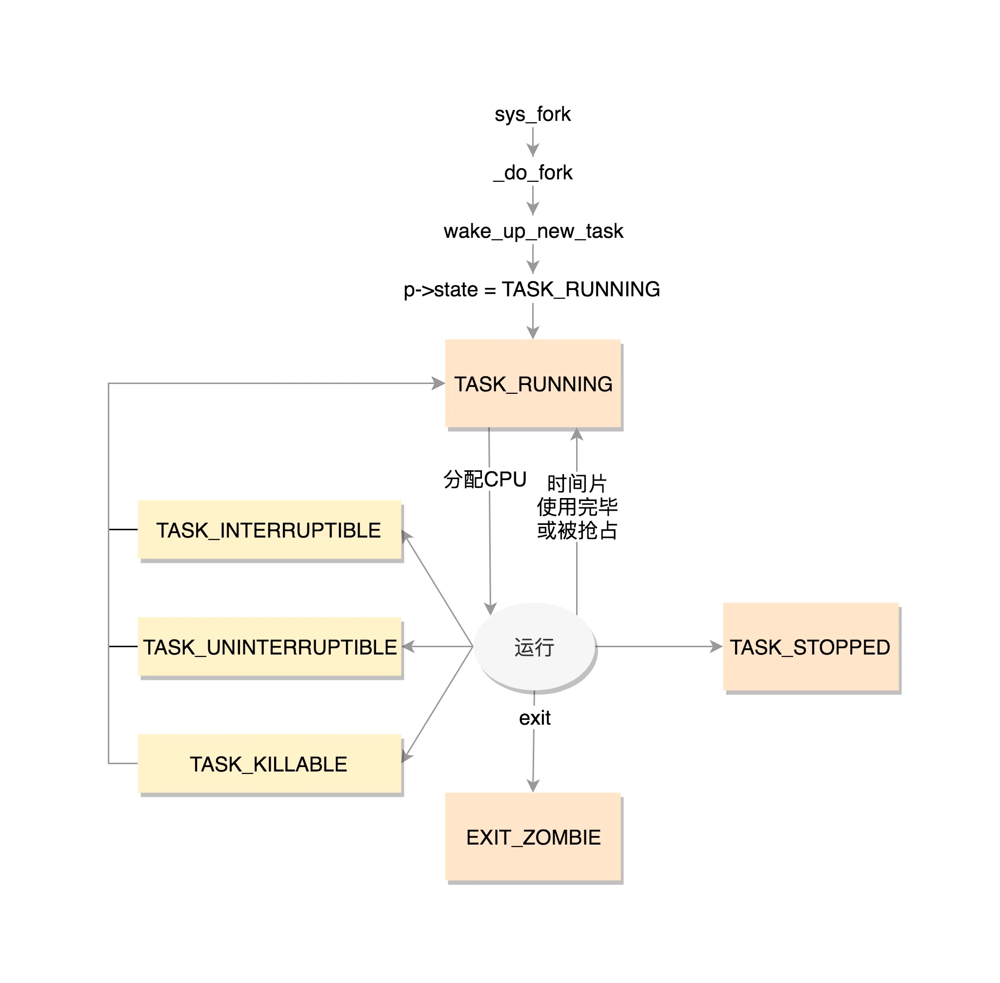
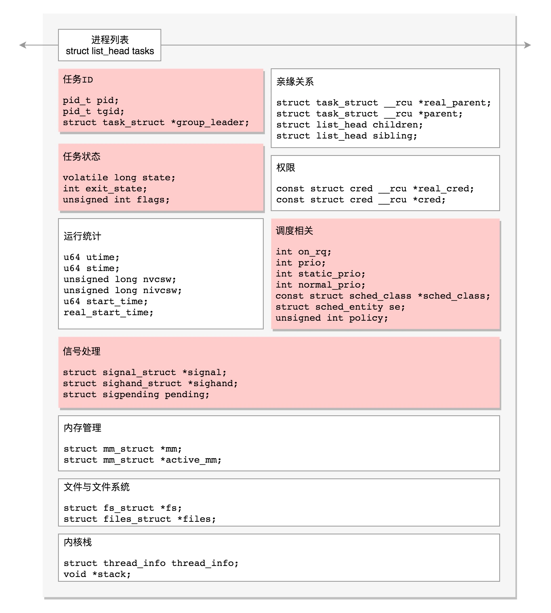

Linux 里面，无论是进程，还是线程，到了内核里面，我们统一都叫任务（Task），由一个统一的结构 task_struct 进行管理。

Linux 内核也应该先弄一个链表，将所有的 task_struct 串起来。

struct list_head    tasks;

task_struct 里面涉及任务 ID 

pid_t pid;
pid_t tgid;
struct task_struct *group_leader; 

pid 是 process id，
tgid 是 thread group ID。

task_struct 里面关于信号处理

/* Signal handlers: */
struct signal_struct    *signal;
struct sighand_struct    *sighand; //信号处理函数进行处理
sigset_t      blocked;  //被阻塞
sigset_t      real_blocked; //被阻塞
sigset_t      saved_sigmask;
struct sigpending    pending;//尚等待处理
unsigned long      sas_ss_sp;
size_t        sas_ss_size;
unsigned int      sas_ss_flags;

task_struct 里面，涉及任务状态的是下面这几个变量：

volatile long state;    /* -1 unrunnable, 0 runnable, >0 stopped */
int exit_state;
unsigned int flags;

state（状态）可以取的值定义在 include/linux/sched.h 头文件中

/* Used in tsk->state: */
#define TASK_RUNNING                    0
#define TASK_INTERRUPTIBLE              1
#define TASK_UNINTERRUPTIBLE            2
#define __TASK_STOPPED                  4
#define __TASK_TRACED                   8
/* Used in tsk->exit_state: */
#define EXIT_DEAD                       16
#define EXIT_ZOMBIE                     32
#define EXIT_TRACE                      (EXIT_ZOMBIE | EXIT_DEAD)
/* Used in tsk->state again: */
#define TASK_DEAD                       64
#define TASK_WAKEKILL                   128
#define TASK_WAKING                     256
#define TASK_PARKED                     512
#define TASK_NOLOAD                     1024
#define TASK_NEW                        2048
#define TASK_STATE_MAX                  4096

state 是通过 bitset 的方式设置的，也就是说，当前是什么状态，哪一位就置一。

TASK_RUNNING 并不是说进程正在运行，而是表示进程在时刻准备运行的状态(就绪状态)。
当处于这个状态的进程获得时间片的时候，就是在运行中；
如果没有获得时间片，就说明它被其他进程抢占了，在等待再次分配时间片。

在运行中的进程，一旦要进行一些 I/O 操作，需要等待 I/O 完毕，这个时候会释放 CPU，进入睡眠状态。
TASK_INTERRUPTIBLE：可中断的睡眠状态。 虽然在睡眠，等待 I/O 完成，但是这个时候一个信号来的时候，进程还是要被唤醒。只不过唤醒后，不是继续刚才的操作，而是进行信号处理。
TASK_UNINTERRUPTIBLE：不可中断的睡眠状态。这是一种深度睡眠状态，不可被信号唤醒，只能死等 I/O 操作完成。
TASK_KILLABLE：可以终止的新睡眠状态。
TASK_WAKEKILL： 用于在接收到致命信号时唤醒进程，而 TASK_KILLABLE 相当于这两位都设置了。
#define TASK_KILLABLE           (TASK_WAKEKILL | TASK_UNINTERRUPTIBLE)
TASK_STOPPED： 是在进程接收到 SIGSTOP、SIGTTIN、SIGTSTP 或者 SIGTTOU 信号之后进入该状态。
TASK_TRACED： 表示进程被 debugger 等进程监视，进程执行被调试程序所停止。

一旦一个进程要结束，先进入的是 EXIT_ZOMBIE 状态，但是这个时候它的父进程还没有使用 wait() 等系统调用来获知它的终止信息，此时进程就成了僵尸进程。
EXIT_DEAD： 是进程的最终状态。
EXIT_ZOMBIE 和 EXIT_DEAD 也可以用于 exit_state

进程状态和进程的运行、调度有关系，还有其他的一些状态，我们称为标志。放在 flags 字段中，这些字段都被定义成为宏，以 PF 开头。

PF_EXITING 表示正在退出
PF_VCPU 表示进程运行在虚拟 CPU 上
PF_FORKNOEXEC 表示 fork 完了，还没有 exec。在 _do_fork 函数里面调用 copy_process，这个时候把 flag 设置为 PF_FORKNOEXEC

