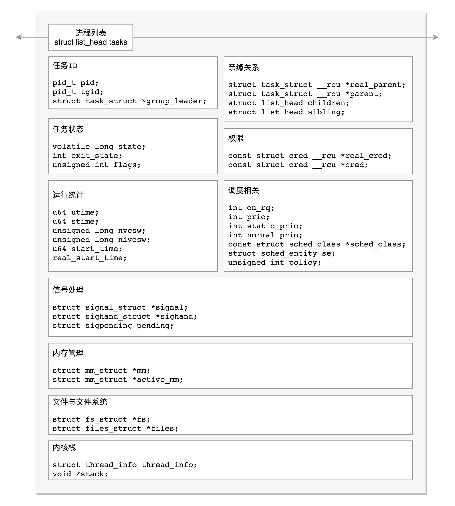

统计信息
进程在用户态和内核态消耗的时间、上下文切换的次数等等

u64        utime;//用户态消耗的CPU时间
u64        stime;//内核态消耗的CPU时间
unsigned long      nvcsw;//自愿(voluntary)上下文切换计数
unsigned long      nivcsw;//非自愿(involuntary)上下文切换计数
u64        start_time;//进程启动时间，不包含睡眠时间
u64        real_start_time;//进程启动时间，包含睡眠时间

整个进程其实就是一棵进程树。而拥有同一父进程的所有进程都具有兄弟关系。
struct task_struct __rcu *real_parent; /* real parent process */
struct task_struct __rcu *parent; /* recipient of SIGCHLD, wait4() reports */
struct list_head children;      /* list of my children */
struct list_head sibling;       /* linkage in my parent's children list */

parent 指向其父进程。当它终止时，必须向它的父进程发送信号。
children 表示链表的头部。链表中的所有元素都是它的子进程。
sibling 用于把当前进程插入到兄弟链表中。

