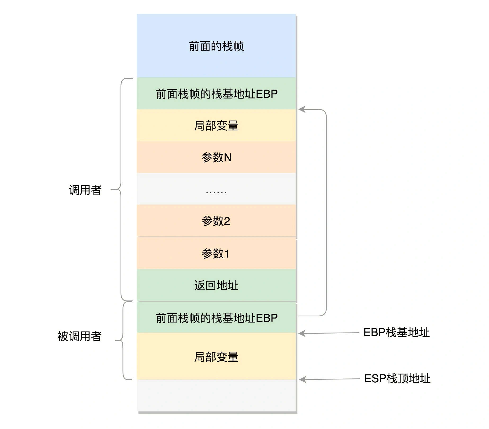

用户态函数栈

在进程的内存空间里面，栈是一个从高地址到低地址，往下增长的结构，也就是上面是栈底，下面是栈顶，入栈和出栈的操作都是从下面的栈顶开始的。

ESP（Extended Stack Pointer）是栈顶指针寄存器，入栈操作 Push 和出栈操作 Pop 指令，会自动调整 ESP 的值。
EBP（Extended Base Pointer），是栈基地址指针寄存器，指向当前栈帧的最底部。

Linux 给每个 task 都分配了内核栈。在 32 位系统上 arch/x86/include/asm/page_32_types.h，是这样定义的：一个 PAGE_SIZE 是 4K，左移一位就是乘以 2，也就是 8K。

内核栈在 64 位系统上 arch/x86/include/asm/page_64_types.h，是这样定义的：在 PAGE_SIZE 的基础上左移两位，也即 16K，并且要求起始地址必须是 8192 的整数倍。

