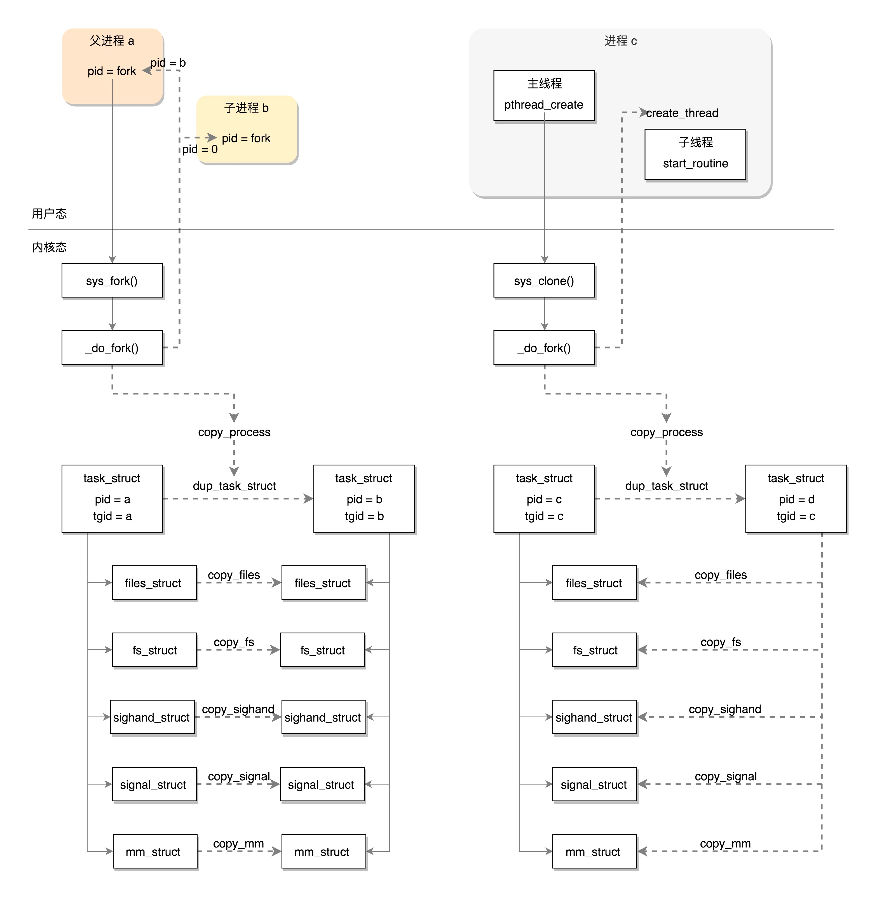

每一个进程或者线程都有一个 task_struct 结构，在用户态也有一个用于维护线程的结构，就是这个 pthread 结构

凡是涉及函数的调用，都要使用到栈。

创建进程的话，调用的系统调用是 fork，在 copy_process 函数里面，会将五大结构 files_struct、fs_struct、sighand_struct、signal_struct、mm_struct 都复制一遍，从此父进程和子进程各用各的数据结构。

而创建线程的话，调用的是系统调用 clone，在 copy_process 函数里面， 五大结构仅仅是引用计数加一，也即线程共享进程的数据结构。

