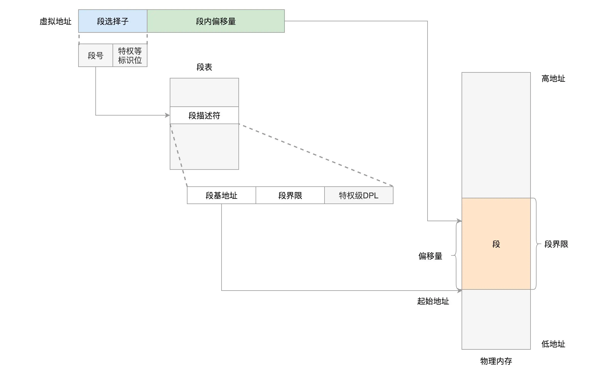
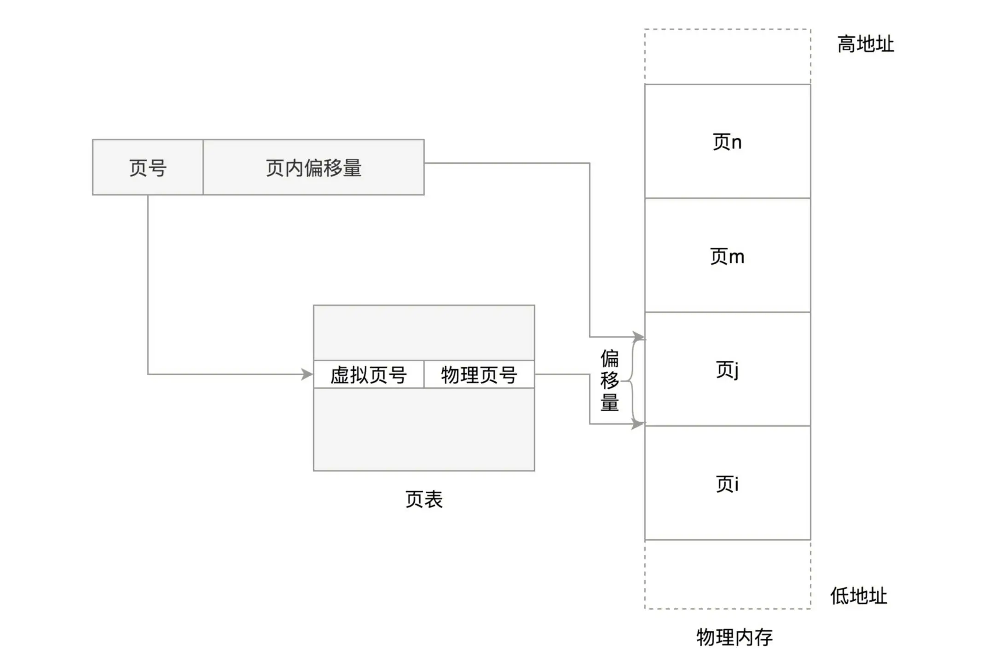
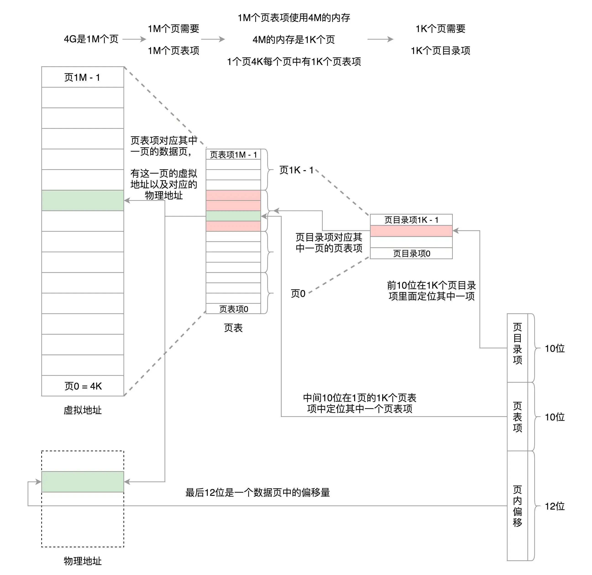
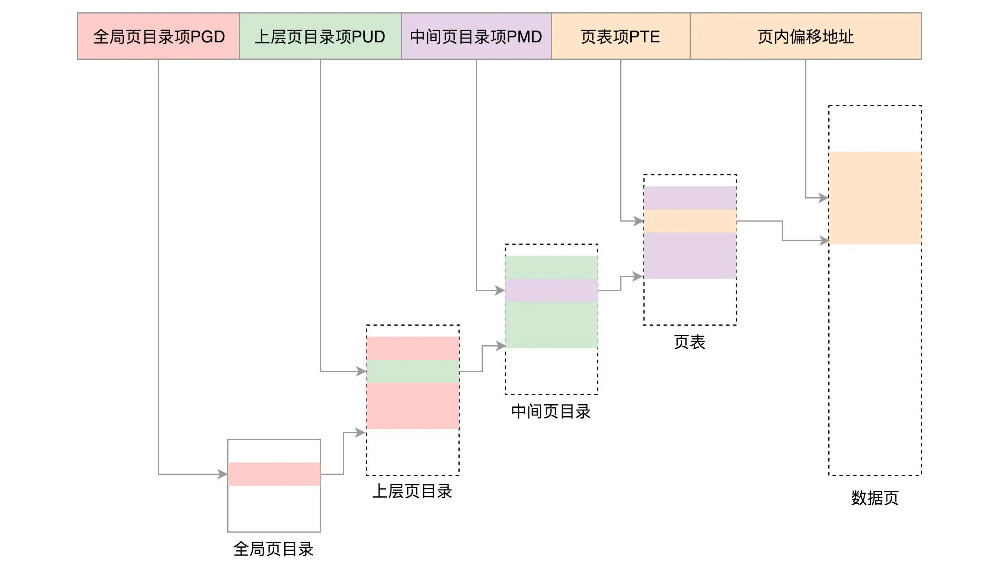

规划虚拟空间的时候，也是将空间分成多个段进行保存。

分段机制下的虚拟地址由两部分组成，段选择子和段内偏移量。

段选择子就保存在咱们前面讲过的段寄存器里面。段选择子里面最重要的是段号，用作段表的索引。

段表里面保存的是这个段的基地址、段的界限和特权等级等。虚拟地址中的段内偏移量应该位于 0 和段界限之间。如果段内偏移量是合法的，就将段基地址加上段内偏移量得到物理内存地址。

虚拟空间分成以下 4 个段，用 0～3 来编号。每个段在段表中有一个项，在物理空间中:

段表全称段描述符表（segment descriptors），放在全局描述符表 GDT（Global Descriptor Table）里面;
一个段表项由段基地址 base、段界限 limit，还有一些标识符组成;

分段可以做权限审核，例如用户态 DPL 是 3，内核态 DPL 是 0;

Linux 倾向于另外一种从虚拟地址到物理地址的转换方式，称为分页（Paging）;

物理内存，操作系统把它分成一块一块大小相同的页，这样更方便管理;
有的内存页面长时间不用了，可以暂时写到硬盘上，称为换出。
一旦需要的时候，再加载进来，叫做换入。

换入和换出都是以页为单位的。页面的大小一般为 4KB。
为了能够定位和访问每个页，需要有个页表，保存每个页的起始地址，再加上在页内的偏移量，组成线性地址，就能对于内存中的每个位置进行访问了。

虚拟地址分为两部分，页号和页内偏移。页号作为页表的索引，页表包含物理页每页所在物理内存的基地址。这个基地址与页内偏移的组合就形成了物理内存地址。

多级页表
32位系统 用前 10 位定位到页目录表中的一项。将这一项对应的页表取出来共 1k 项，再用中间 10 位定位到页表中的一项，将这一项对应的存放数据的页取出来，再用最后 12 位定位到页中的具体位置访问数据。

对于 64 位的系统，就变成了四级目录，分别是全局页目录项 PGD（Page Global Directory）、上层页目录项 PUD（Page Upper Directory）、中间页目录项 PMD（Page Middle Directory）和页表项 PTE（Page Table Entry）。

