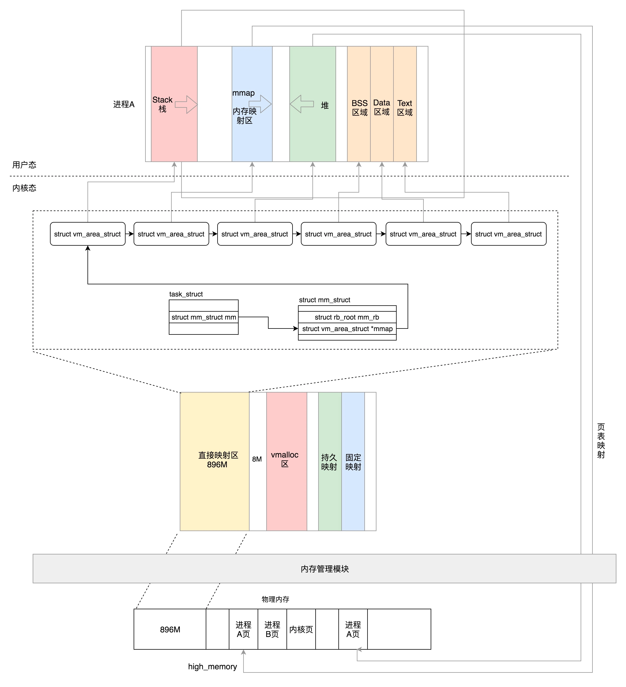

对于 32 位系统，最大能够寻址 2^32=4G，其中用户态虚拟地址空间是 3G，内核态是 1G。

对于 64 位系统，虚拟地址只使用了 48 位。就像代码里面写的一样，1 左移了 47 位，就相当于 48 位地址空间一半的位置，0x0000800000000000，然后减去一个页，就是 0x00007FFFFFFFF000，共 128T。同样，内核空间也是 128T。内核空间和用户空间之间隔着很大的空隙，以此来进行隔离。

用户态

内核态
32 位的内核态的布局

64位的内核态的布局

一个进程要运行起来需要以下的内存结构。
用户态：
 代码段、 全局变量、 BSS函数栈堆内存映射区
 函数栈
 堆
 内存映射区

内核态：
 内核的代码、全局变量、BSS
 内核数据结构例如 task_struct
 内核栈
 内核中动态分配的内存

32位

64位

 

