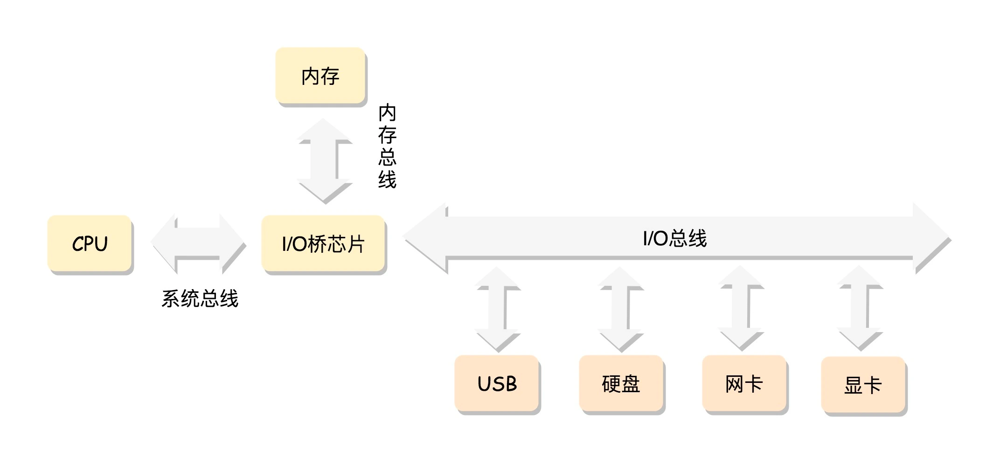

x86 的工作模式 CPU 是通过总线去访问内存的，这就是最经典的内存使用方式。

Linux 中的内存管理的“页”大小为 4KB。把所有的空闲页分组为 11 个页块链表，每个块链表分别包含很多个大小的页块，有 1、2、4、8、16、32、64、128、256、512 和 1024 个连续页的页块。最大可以申请 1024 个连续页，对应 4MB 大小的连续内存。每个页块的第一个页的物理地址是该页块大小的整数倍.

小内存的分配
使用 slub 分配器进行分配
