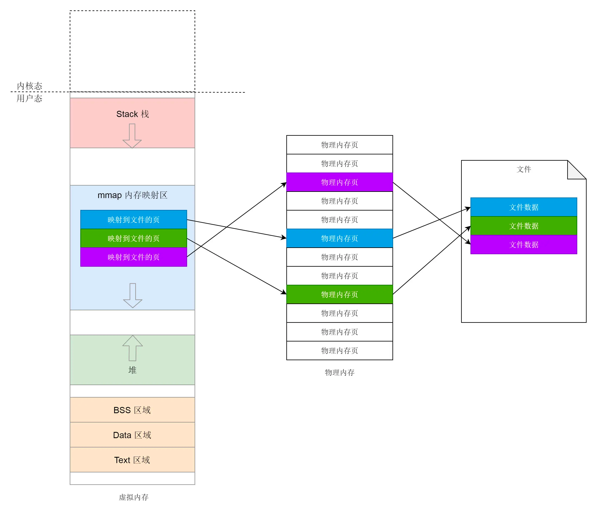
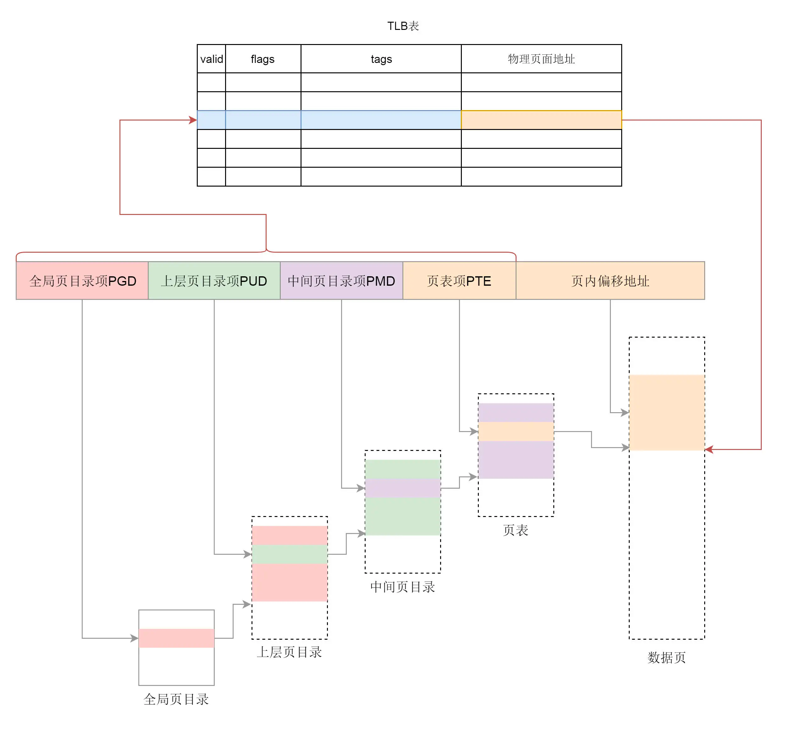

内存映射不仅仅是物理内存和虚拟内存之间的映射，还包括将文件中的内容映射到虚拟内存空间。
访问内存空间就能够访问到文件里面的数据。而仅有物理内存和虚拟内存的映射，是一种特殊情况。

用户态缺页异常
一旦开始访问虚拟内存的某个地址，如果我们发现，并没有对应的物理页，那就触发缺页中断，调用 do_page_fault。

为了加快映射速度，我们不需要每次从虚拟地址到物理地址的转换都走一遍页表。
为了提高映射速度，我们引入了 TLB（Translation Lookaside Buffer），我们经常称为快表，专门用来做地址映射的硬件设备。

