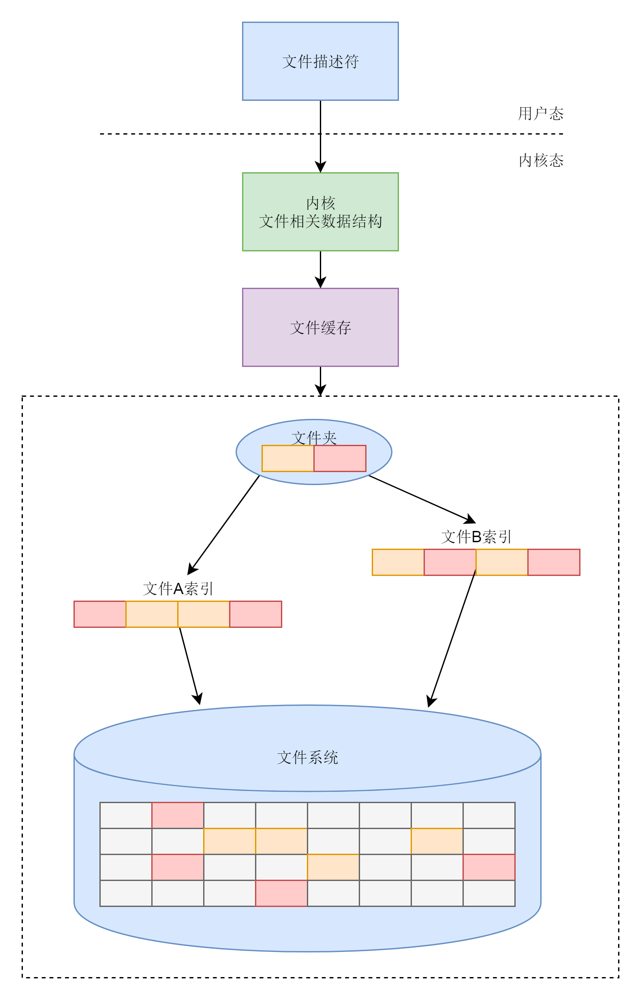

Windows 的时候，咱们常格式化的格式为 NTFS（New Technology File System）。
在 Linux 下面，常用的是 ext3 或者 ext4。

通过命令 fdisk -l，查看格式化和没有格式化的分区。
通过命令 mkfs.ext3 或者 mkfs.ext4 进行格式化。

格式化后的硬盘，需要挂在到某个目录下面，才能作为普通的文件系统进行访问
mount /dev/vdc1 /根目录/用户A目录/目录1

将这个文件系统挂载到“/ 根目录 / 用户 A 目录 / 目录 1”这个目录下面

有挂载就有卸载，卸载使用 umount 命令。
umount /根目录/用户A目录/目录1

  - 表示普通文件；
  d 表示文件夹；
  c 表示字符设备文件，这在设备那一节讲解；
  b 表示块设备文件，这也在设备那一节讲解；
  s 表示套接字 socket 文件，这在网络那一节讲解；
  l 表示符号链接，也即软链接，就是通过名字指向另外一个文件，例如下面的代码，instance 这个文件就是指向了 /var/lib/cloud/instances 这个文件。软链接的机制我们这一章会讲解

当使用系统调用 open 打开一个文件时，操作系统会创建一些数据结构来表示这个被打开的文件。
在进程中，我们会为这个打开的文件分配一个文件描述符 fd（File Descriptor）。

文件描述符，就是用来区分一个进程打开的多个文件的。
在 Open 函数中，有一些参数：
  O_CREAT 表示当文件不存在，创建一个新文件；
  O_RDWR 表示以读写方式打开；
  O_TRUNC 表示打开文件后，将文件的长度截断为 0。

write 要用于写入数据。
第一个参数就是文件描述符，第二个参数表示要写入的数据存放位置，第三个参数表示希望写入的字节数，返回值表示成功写入到文件的字节数。

lseek 用于重新定位读写的位置，
第一个参数是文件描述符，第二个参数是重新定位的位置，第三个参数是 SEEK_SET，表示起始位置为文件头，第二个参数和第三个参数合起来表示将读写位置设置为从文件头开始 0 的位置，也即从头开始读写。

read 用于读取数据，
第一个参数是文件描述符，第二个参数是读取来的数据存到指向的空间，第三个参数是希望读取的字节数，返回值表示成功读取的字节数。

close 将关闭一个文件。

stat  没有处理符号链接（软链接）的能力。如果一个文件是符号链接，stat 会直接返回它所指向的文件的属性。
lstat 返回的就是这个符号链接的内容。
fstat 则是通过文件描述符获取文件对应的属性。

opendir 函数打开一个目录名所对应的 DIR 目录流。并返回指向 DIR 目录流的指针。流定位在 DIR 目录流的第一个条目。
readdir 函数从 DIR 目录流中读取一个项目，返回的是一个指针，指向 dirent 结构体，且流的自动指向下一个目录条目。
closedir() 关闭参数 dir 所指的目录流。

