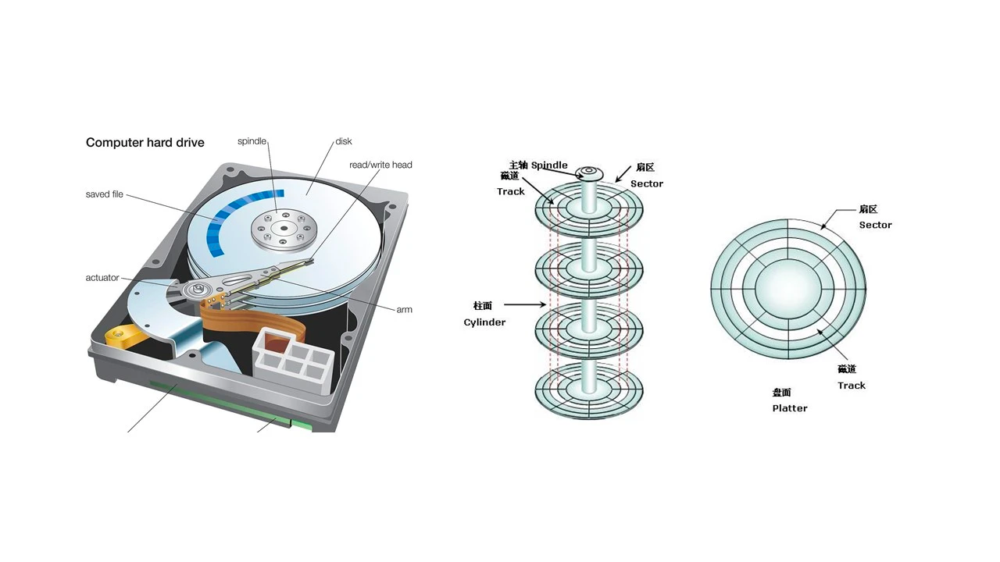
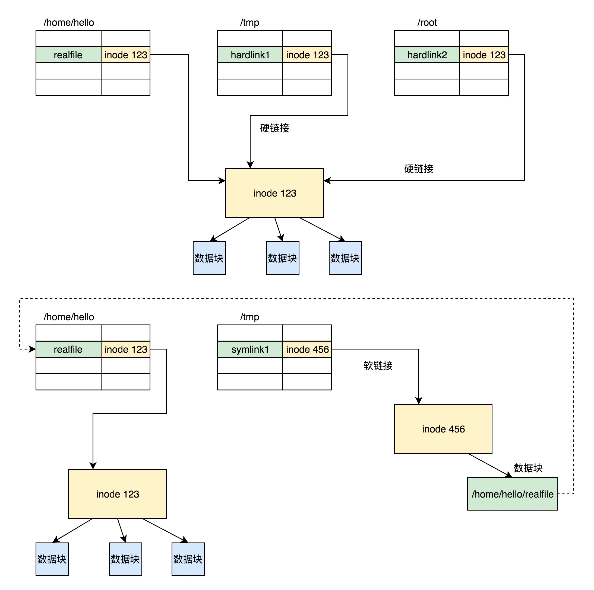

Linux 下最主流的文件系统格式——ext 系列的文件系统的格式。

硬盘分成相同大小的单元，我们称为块（Block）。一块的大小是扇区大小的整数倍，默认是 4K。在格式化的时候，这个值是可以设定的。

文件还有元数据部分，例如名字、权限等，这就需要一个结构 inode 来存放。
我们每个文件都会对应一个 inode；一个文件夹就是一个文件，也对应一个 inode。

struct ext4_inode {
__le16  i_mode;    /* File mode */
__le16  i_uid;    /* Low 16 bits of Owner Uid */
__le32  i_size_lo;  /* Size in bytes */
__le32  i_atime;  /* Access time */
__le32  i_ctime;  /* Inode Change time */
__le32  i_mtime;  /* Modification time */
__le32  i_dtime;  /* Deletion Time */
__le16  i_gid;    /* Low 16 bits of Group Id */
__le16  i_links_count;  /* Links count */
__le32  i_blocks_lo;  /* Blocks count */
__le32  i_flags;  /* File flags */
......
__le32  i_block[EXT4_N_BLOCKS];/* Pointers to blocks */
__le32  i_generation;  /* File version (for NFS) */
__le32  i_file_acl_lo;  /* File ACL */
__le32  i_size_high;
......
};

对整个文件系统的情况进行描述，这个就是超级块ext4_super_block。这里面有整个文件系统一共有多少 inode，s_inodes_count；一共有多少块，s_blocks_count_lo，每个块组有多少 inode，s_inodes_per_group，每个块组有多少块，s_blocks_per_group 等。这些都是这类的全局信息。

硬链接与原始文件共用一个 inode 的；
软链接是分配了一个新的 inode，链接的地址是已有的 inode;
