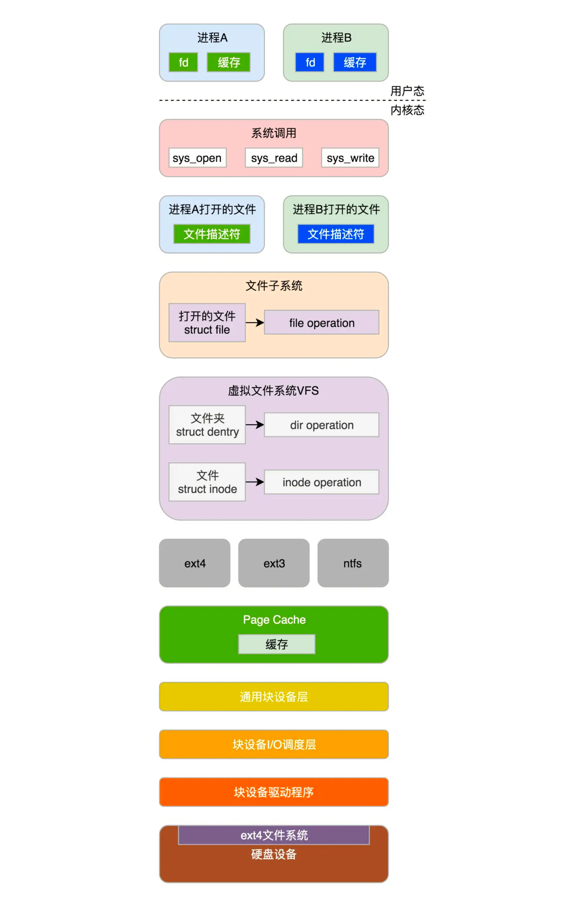
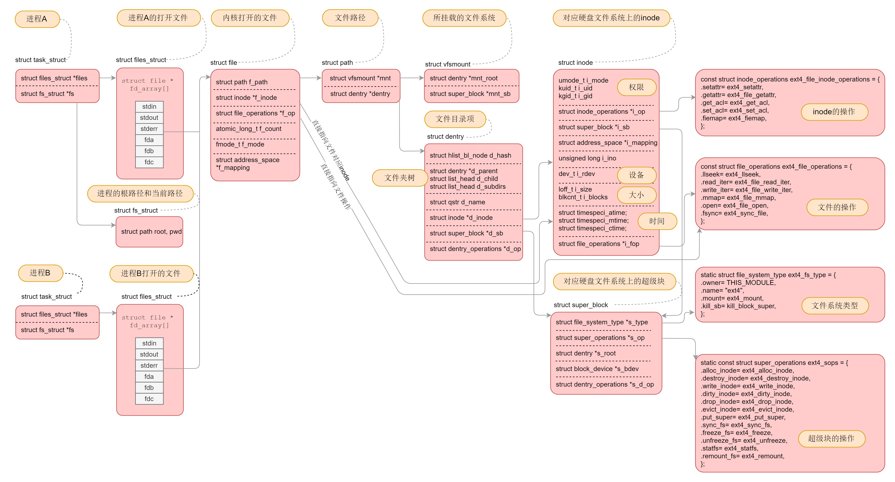

文章的核心就是把磁盘文件数据映射到进程中，可以把在磁盘的文件组织看成一种协议，内存中进程中的文件组织形式看成另外一种协议，内核就是这两个协议的中转proxy,带着这个主线看文章思路要明朗一些
inode和dentry在一个文件系统挂载的时候怎么初始化和做好映射关系，这个是难点，我一开始也看懵逼了，后来一想，根文件系统不是挂载了各种磁盘分区的文件系统么，这个老师如果结合centos的xfs根文件系统下，可以挂载ext4的文件系统，并且用一个磁盘分区演示挂载，然后分析，可能大家更好理解，毕竟平时大家都是一个文件系统格式走到黑，个人建议这种复杂逻辑关系比如那个挂载图可以拍个动态图和视频，发个链接让大家去看看，

查看文件缓存:通过free命令中的buff/cache一栏的信息即可看到文件缓存的用量。
清除缓存：sync; echo 1 > /proc/sys/vm/drop_caches

