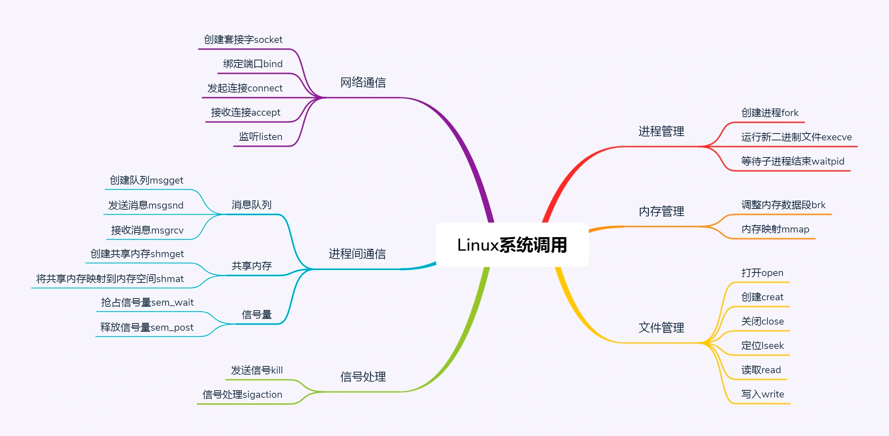

创建进程的系统调用叫fork。

对于 fork 系统调用的返回值，
如果当前进程是子进程，就返回 0；
如果当前进程是父进程，就返回子进程的进程号

这样首先在返回值这里就有了一个区分，然后通过 if-else 语句判断，
如果是父进程，还接着做原来应该做的事情；
如果是子进程，需要请求另一个系统调用execve来执行另一个程序，这个时候，子进程和父进程就彻底分道扬镳了，也就产生了一个分支（fork）了。

有个系统调用waitpid，父进程可以调用它，将子进程的进程号作为参数传给它，这样父进程就知道子进程运行完了没有，成功与否。
僵尸进程： 子进程已结束，父进程还没调用waitpid,回收子进程的资源。

对于进程的内存空间来讲，（此处应该是虚拟内存）
放程序代码的这部分，我们称为代码段（Code Segment）。
放进程运行中产生数据的这部分，我们称为数据段（Data Segment）。
局部变量的部分，在当前函数执行的时候起作用，当进入另一个函数时，这个变量就释放了，这部分称为栈段（Stack Segment）；
也有动态分配的，会较长时间保存，指明才销毁的，这部分称为堆（Heap Segment）。

两个在堆里面分配内存的系统调用，brk和mmap。

Glibc 是 Linux 下使用的开源的标准 C 库，它是 GNU 发布的 libc 库。Glibc 为程序员提供丰富的 API，除了例如字符串处理、数学运算等用户态服务之外，最重要的是封装了操作系统提供的系统服务，即系统调用的封装。

