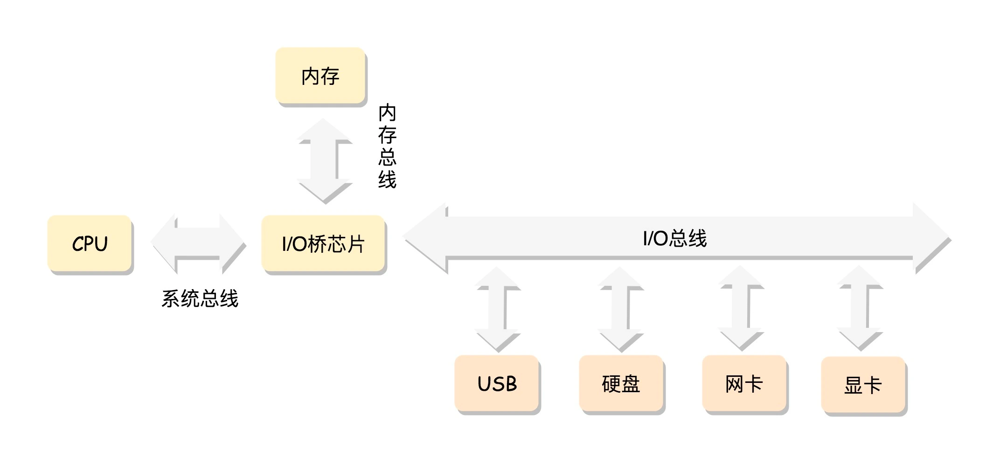
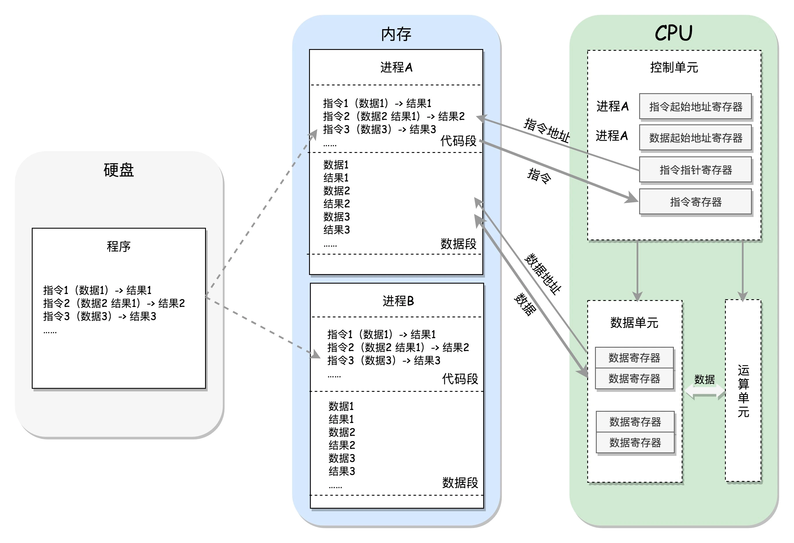
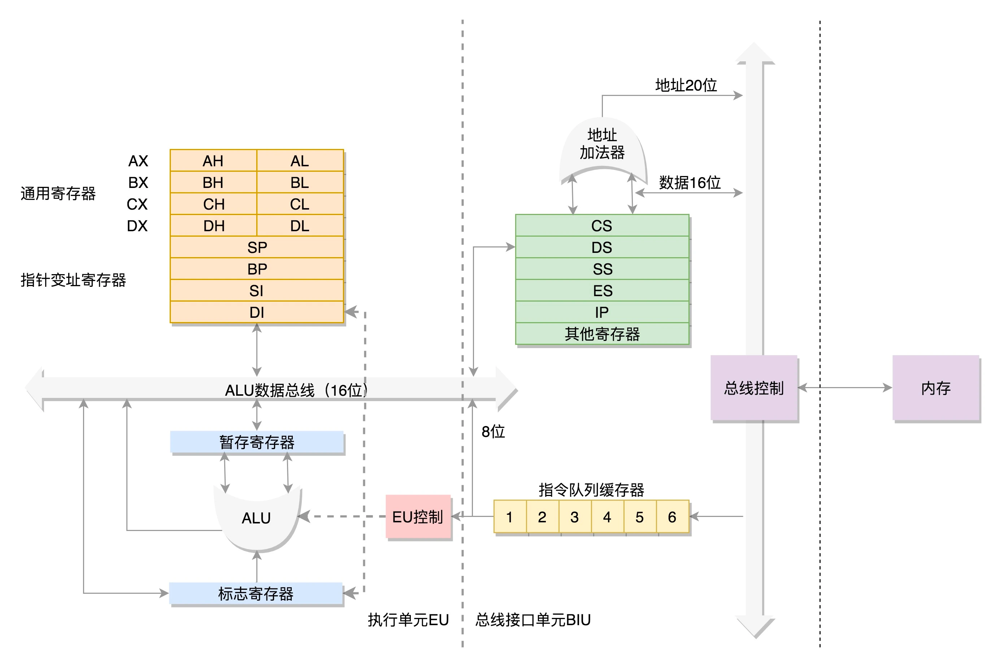
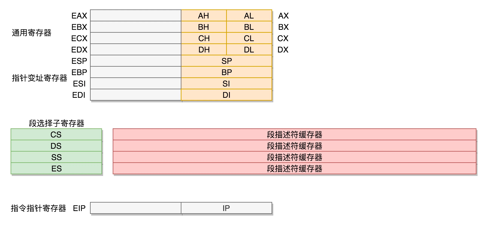

CPU（Central Processing Unit，中央处理器）

CPU 和其他设备连接，要靠一种叫作总线（Bus）的东西，其实就是主板上密密麻麻的集成电路，这些东西组成了 CPU 和其他设备的高速通道。

CPU 其实也不是单纯的一块，它包括三个部分，
运算单元、
数据单元、
控制单元： 

有一个指令指针寄存器，它里面存放的是下一条指令在内存中的地址。控制单元会不停地将代码段的指令拿进来，先放入指令寄存器。

当前的指令分两部分，一部分是做什么操作，例如是加法还是位移；一部分是操作哪些数据。
要执行这条指令，就要把第一部分交给运算单元，第二部分交给数据单元。

数据单元根据数据的地址，从数据段里读到数据寄存器里，就可以参与运算了。
运算单元做完运算，产生的结果会暂存在数据单元的数据寄存器里。 最终，会有指令将数据写回内存中的数据段。

CPU 和内存来来回回传数据，靠的都是总线。 其实总线上主要有两类数据，
一个是地址数据，也就是我想拿内存中哪个位置的数据，这类总线叫地址总线（Address Bus）；
另一类是真正的数据，这类总线叫数据总线（Data Bus）。

地址总线的位数，决定了能访问的地址范围到底有多广。
数据总线的位数，决定了一次能拿多少个数据进来。

为了暂存数据，8086 处理器内部有 8 个 16 位的通用寄存器，也就是刚才说的 CPU 内部的数据单元，分别是 AX、BX、CX、DX、SP、BP、SI、DI。这些寄存器主要用于在计算过程中暂存数据。

AX、BX、CX、DX 可以分成两个 8 位的寄存器来使用，分别是 AH、AL、BH、BL、CH、CL、DH、DL，其中 H 就是 High（高位），L 就是 Low（低位）的意思。

IP 寄存器就是指令指针寄存器（Instruction Pointer Register)，指向代码段中下一条指令的位置。

如果需要切换进程，每个进程都分代码段和数据段，为了指向不同进程的地址空间，有四个 16 位的段寄存器，分别是 CS、DS、SS、ES。

CS 是代码段寄存器（Code Segment Register），它找到代码在内存中的位置。
DS 是数据段的寄存器，它可以找到数据在内存中的位置。
SS 是栈寄存器（Stack Register）。栈是程序运行中一个特殊的数据结构，数据的存取只能从一端进行，秉承后进先出的原则，push 就是入栈，pop 就是出栈。

在 CS 和 DS 中都存放着一个段的起始地址。代码段的偏移量在 IP 寄存器中，数据段的偏移量会放在通用寄存器中。

段的起始地址放在内存的某个地方。这个地方是一个表格，表格中的一项一项是段描述符（Segment Descriptor）。
这里面才是真正的段的起始地址。而段寄存器里面保存的是在这个表格中的哪一项，称为选择子（Selector）

为了快速拿到段起始地址，段寄存器会从内存中拿到 CPU 的描述符高速缓存器中。

