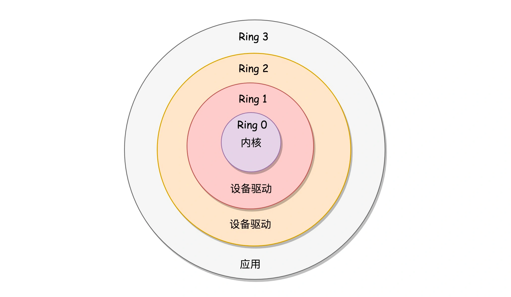
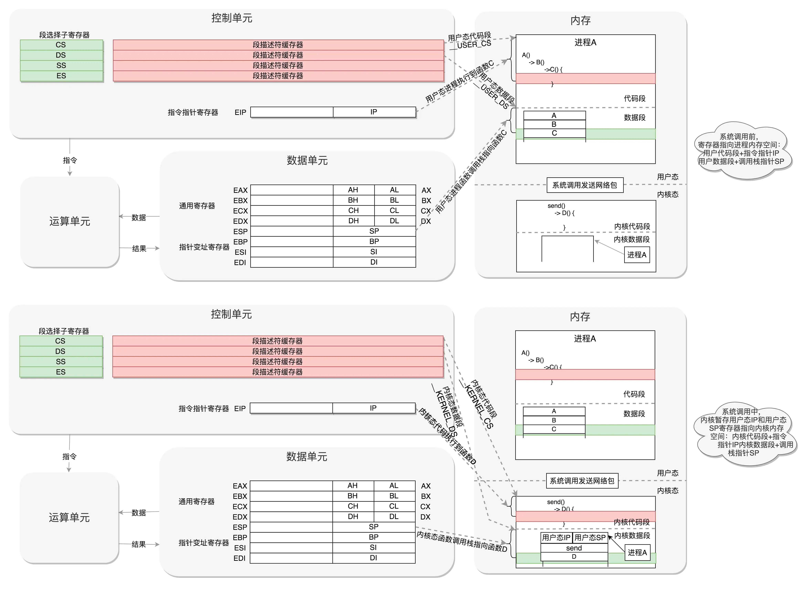

在操作系统里面，先要有个创始进程，有一行指令 set_task_stack_end_magic(&init_task)。
这里面有一个参数 init_task，它的定义是 struct task_struct init_task = INIT_TASK(init_task)。
它是系统创建的第一个进程，我们称为 0 号进程。
这是唯一一个没有通过 fork 或者 kernel_thread 产生的进程，是进程列表的第一个。

rest_init 的第一大工作是，用 kernel_thread(kernel_init, NULL, CLONE_FS) 创建第二个进程，这个是 1 号进程。

权限机制

进程暂停（阻塞）怎么实现：
把程序运行到一半的情况保存下来。例如，内存是用来保存程序运行时候的中间结果的，现在要暂时停下来，这些中间结果不能丢，因为再次运行的时候，还要基于这些中间结果接着来。另外就是，当前运行到代码的哪一行了，当前的栈在哪里，这些都是在寄存器里面的。

这个过程就是这样的：用户态 - 系统调用 - 保存寄存器 - 内核态执行系统调用 - 恢复寄存器 - 返回用户态，然后接着运行。

