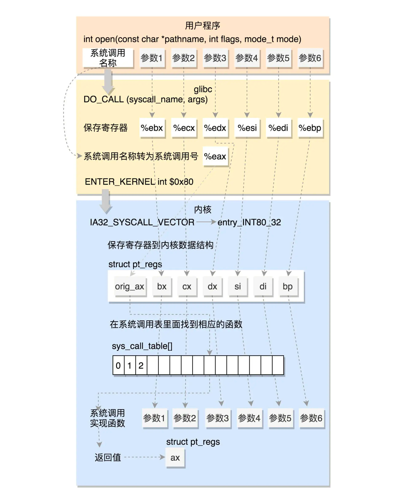
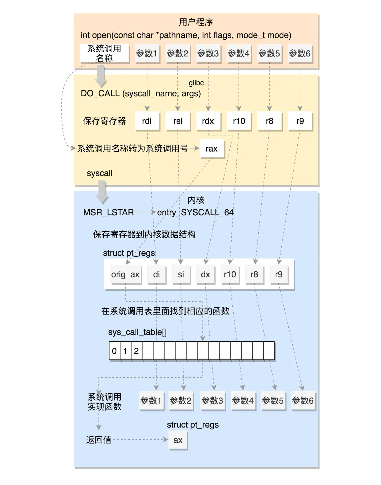
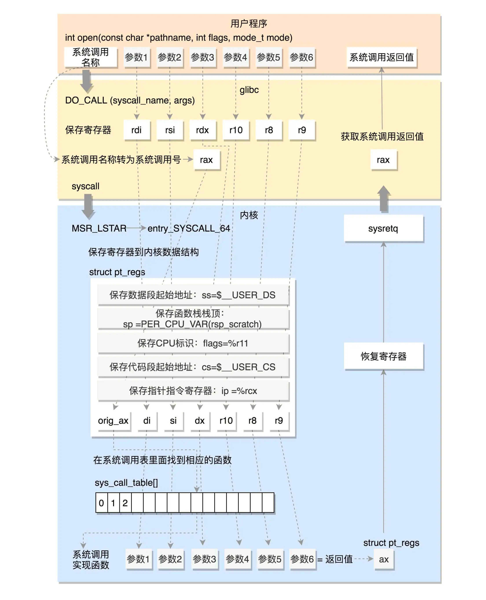

/* Linux takes system call arguments in registers:
syscall number  %eax       call-clobbered
arg 1    %ebx       call-saved
arg 2    %ecx       call-clobbered
arg 3    %edx       call-clobbered
arg 4    %esi       call-saved
arg 5    %edi       call-saved
arg 6    %ebp       call-saved
......
*/
#define DO_CALL(syscall_name, args)                           \
    PUSHARGS_##args                               \
    DOARGS_##args                                 \
    movl $SYS_ify (syscall_name), %eax;                          \
    ENTER_KERNEL                                  \
    POPARGS_##args

我们将请求参数放在寄存器里面，根据系统调用的名称，得到系统调用号，放在寄存器 eax 里面，然后执行 ENTER_KERNEL。

# define ENTER_KERNEL int $0x80
int 就是 interrupt，也就是“中断”的意思。int $0x80 就是触发一个软中断，通过它就可以陷入（trap）内核。

#define INTERRUPT_RETURN                iret
iret 指令将原来用户态保存的现场恢复回来，包含代码段、指令指针寄存器等。这时候用户态进程恢复执行。

32位调用的过程

64 位的系统调用返回的时候，执行的是 USERGS_SYSRET64。定义如下：

#define USERGS_SYSRET64        \
swapgs;          \
sysretq;

64 位的系统调用是如何执行的

系统调用表 sys_call_table 

