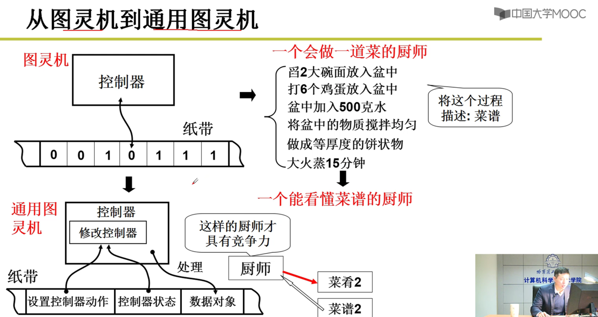
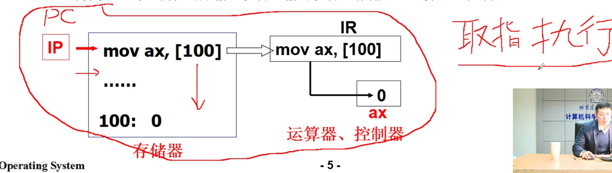
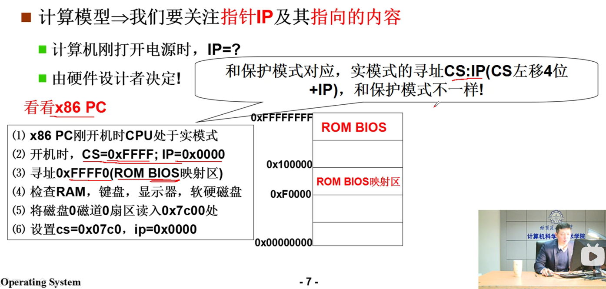
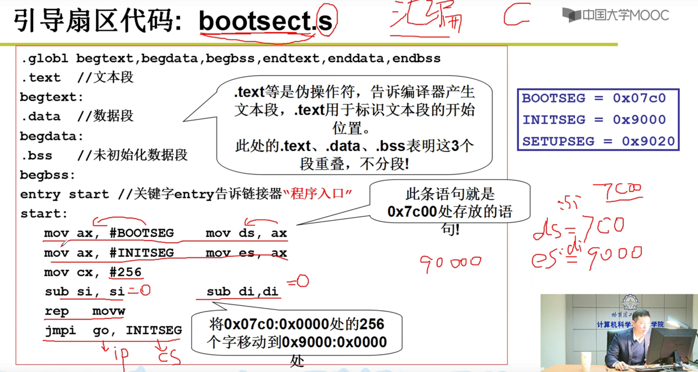
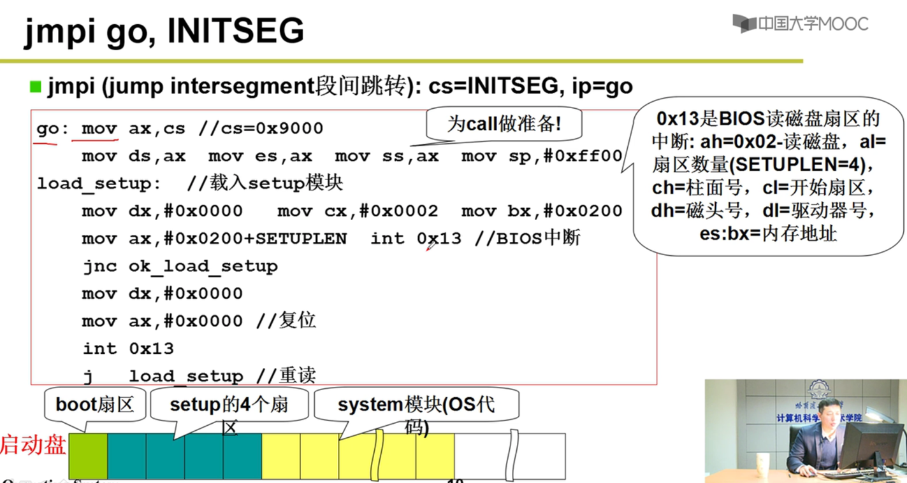
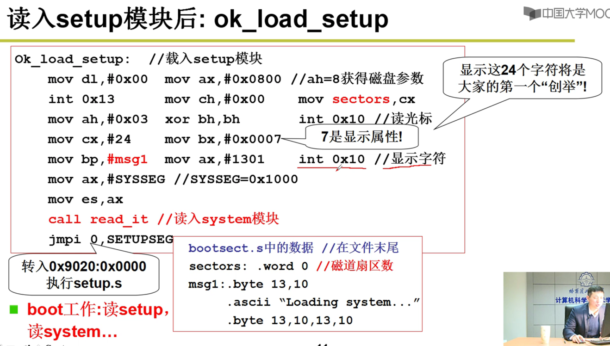

思考：
基于常识和知识，进行推理

发现问题，思考，解决问题

刚启动时，IP指向内存中的  地址，


计算机怎么工作？
取指令，执行指令

程序存入内存，cpu从内存中取指令，加载程序到cpu执行

pc指针  program conuter
程序计数器，或PC。也称为指令指针，或指令地址寄存器，或仅仅是指令时序（在某些计算机中）的一部分，是一个处理器寄存器，指示计算机在其指令序列中的位置。

ip指针 instruction pointer

1.86PC机开机时CPU处于实模式，
2.开机时CS=0XFFFF;IP=0X0000
3.寻址：CS左移4位+IP 正好是 0xFFFF0  (ROM BIOS的映射区)
4.检查硬件，RAM,硬盘，显示器
5.将磁盘0磁道0扇区读入0x7C00处
   0磁道0扇区就是操作系统的引导扇区；
   一个扇区512个字节
6.设置cs=0x07c0，ip=0x0000

引导扇区

引导扇区为什么使用汇编？
高级语言，比如C，需要经过编译，无法确定编译后在内存中的位置；
汇编语言，汇编中每一条指令都变成了真正的机器指令，可以进行完整地控制

0x13（13号中断）是BIOS的读磁盘区的中断，

