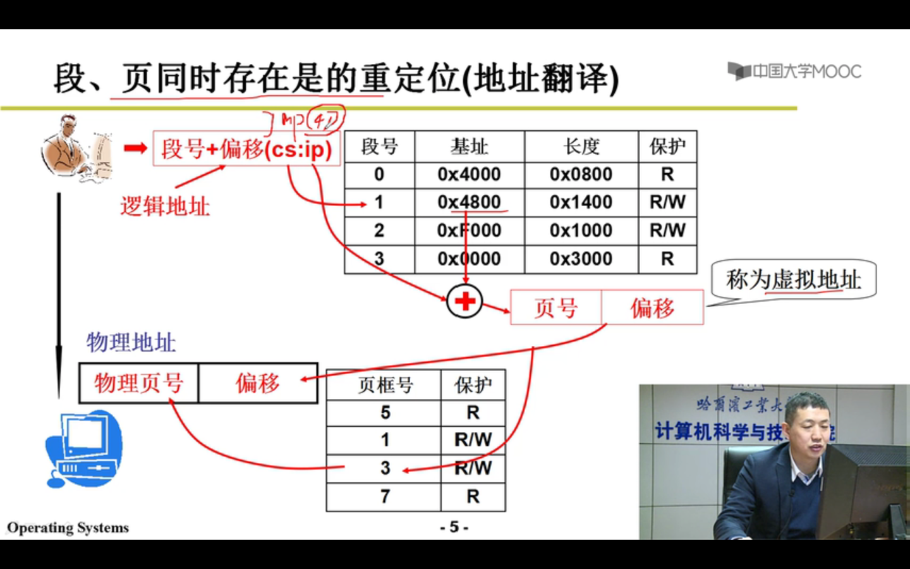
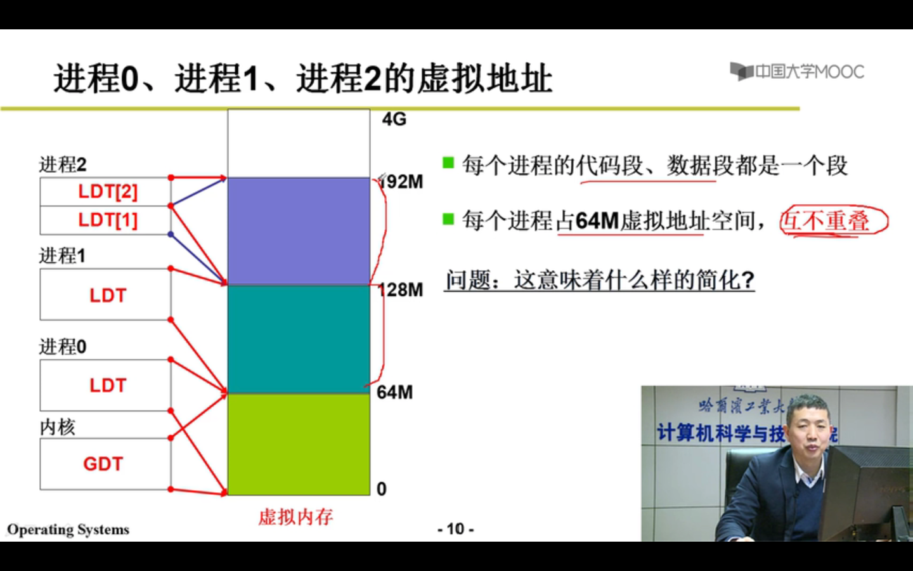
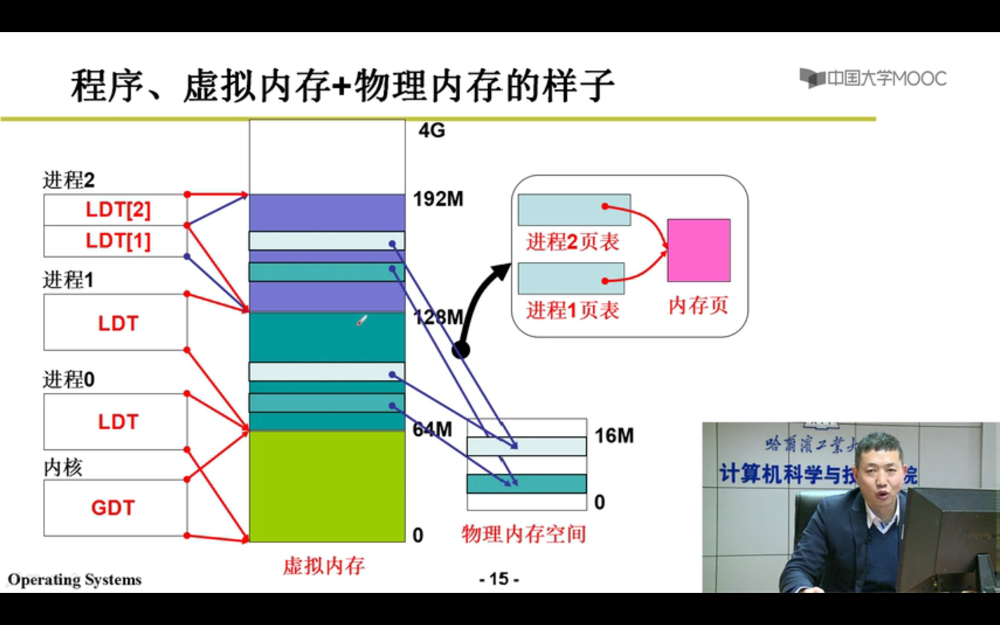
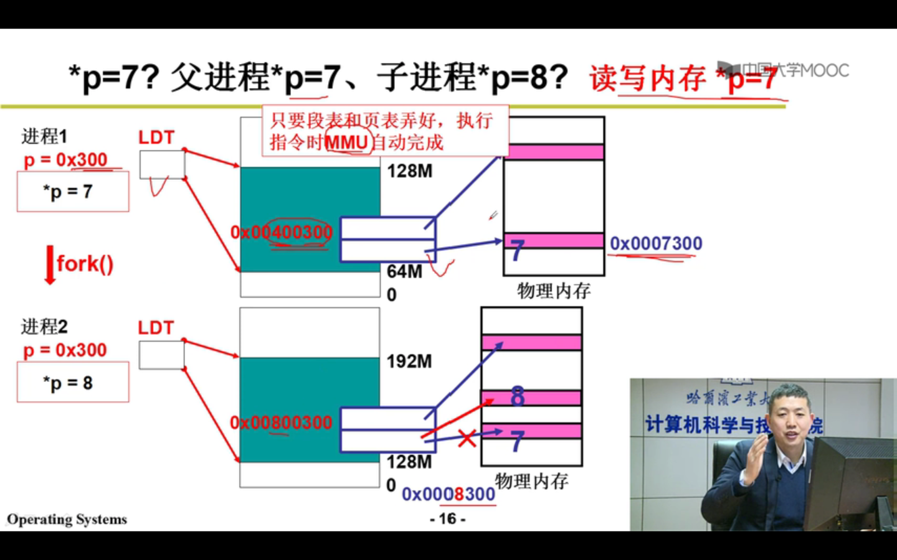

运行时重定位：计算物理内存地址

让程序执行起来->需要创建进程->在内存中找到空闲区域，创建PCB，将空闲区域起始地址赋给PCB->将程序加载到空闲区域

分段：是将整个程序全部全部载入内存吗？
精心控制，
每个段可以分别放入内存

地址翻译：

内存管理的核心是内存分配，从程序放入内存，使用内存开始。。。
分配段、建段表； 分配页、建页表；

从进程fork中的内存分配开始。。。
1. copy_process, 
2. copy_mem  设置基址，虚拟内存的基址，将虚拟内存分割，建段表；
3. 切换pcb
4.分页，建页表
   

段页式如何载入内存？

1.在虚拟内存中割出一段区域（分区适配算法），存放程序的代码段，数据段等。
2.将虚拟内存中的段再分页，和物理内存中的页映射起来。
3.

逻辑地址-》虚拟地址-》物理地址

LDT -》 段表-》页表

MMU自动完成地址翻译

