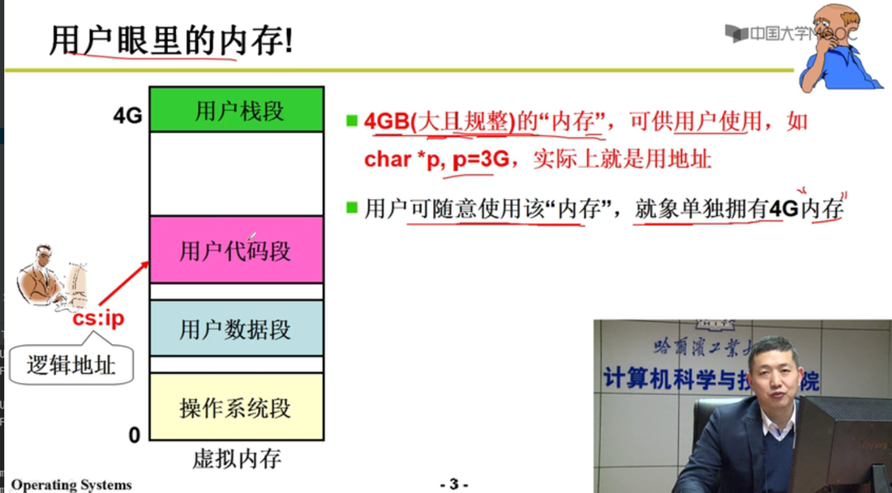
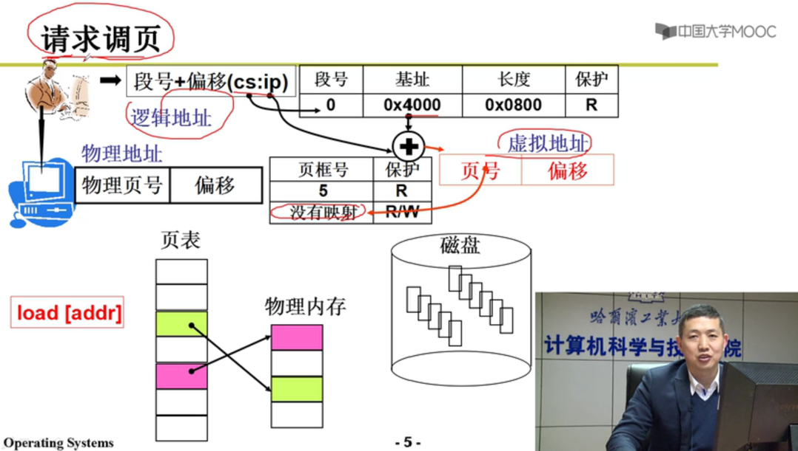
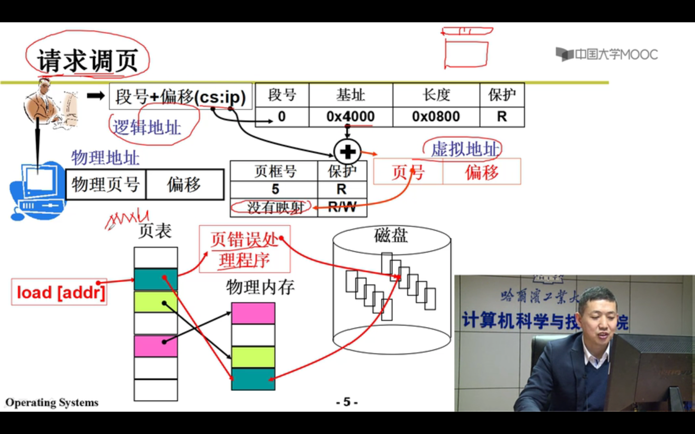
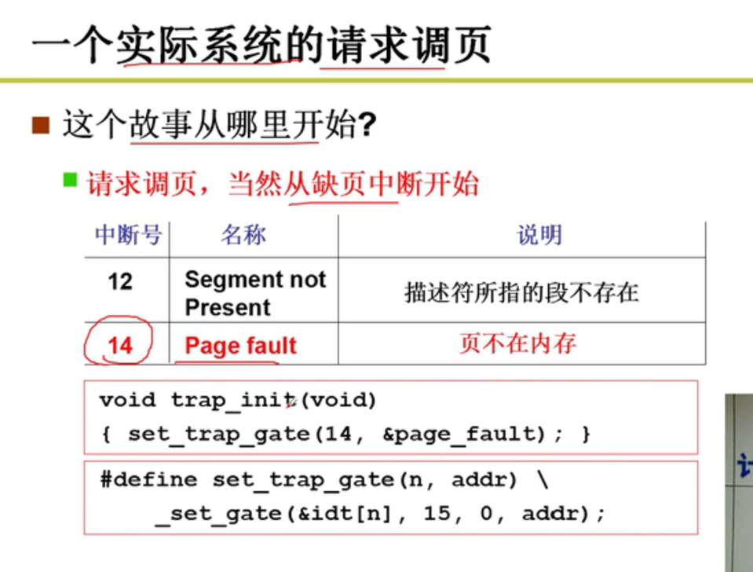

实现虚拟内存，必须有内存的换入换出

为了让用户使用方便，分段；
但对物理内存来说，分段的空间效率低，容易产生内存碎片；
虚拟内存兼顾了用户和硬件，将分段和分页结合了起来；
要实现虚拟内存，必须有内存的换入和换出；

用户眼里的内存

换入换出实现"大内存" 

虚拟内存相当于仓库，物理内存相当于店面；

请求的时候，虚拟内存和物理内存才建立映射；

缺页：
mmu产生中断-》中断处理：请求调页-》加载到物理内存

缺页处理：
申请物理页，
读磁盘，
建立虚拟内存到物理内存的映射 （修改页表）
读到空闲的物理内存页

