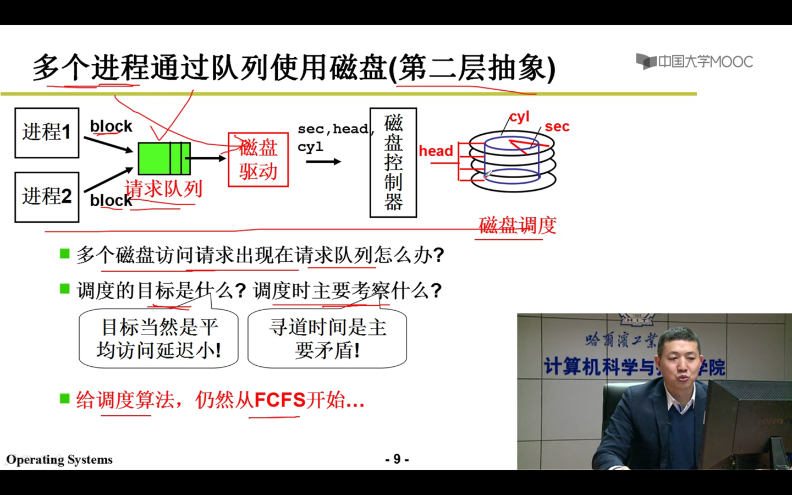
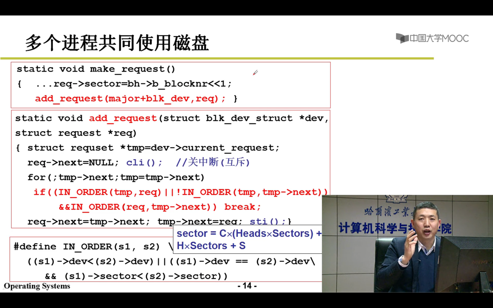

相邻盘块的盘块号尽量放在同一磁道上，减少寻道时间。

如：0号扇区和1号扇区放在同一个盘面上。同一盘面排完后，再排下一盘面。

Cyl: C,柱面；
Head:H，磁头；
Sec:S,扇区；
block号 = C x(Heads x Sectors) + H x Sectores + S
盘块号 = C x (磁头数 x 每个盘面的扇区数) + H x 每个盘面的扇区数 + S

根据block号，可以计算出 扇区号

磁盘访问时间 = 寻道时间 + 旋转时间 + 传输时间

应用程序按 block来读写，一个block包含多个连续扇区； 空间换时间；

电梯算法

