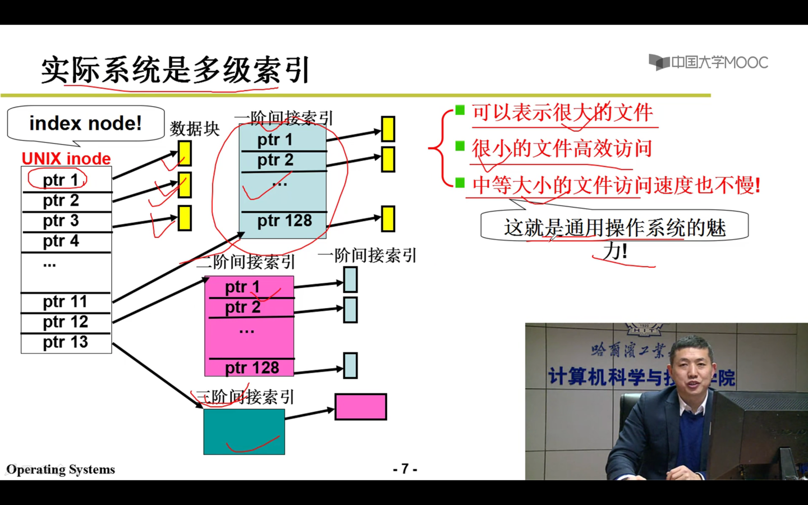

用户眼里文件：字符流
磁盘：盘块号

文件：建立字符流 到 盘块号集合的映射关系

连续结构实现文件，不适合动态增长的文件，适合读。（数组）
映射表FCB：
文件名   起始块号  块数
test.c   6      3

不连续结构实现文件，适合动态增长的文件，不适合读，因为需要从头遍历。（链表）
映射表FCB:
文件名   起始块号  
test.c   6     

第三种结构,索引结构，inode

映射表FCB：
文件名  索引块

索引块  盘块号

实际上磁盘采用多级索引结构

