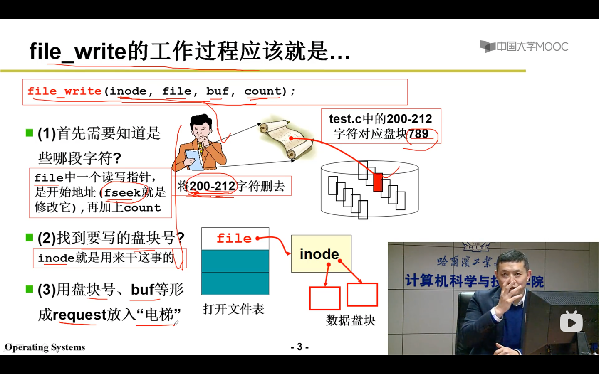
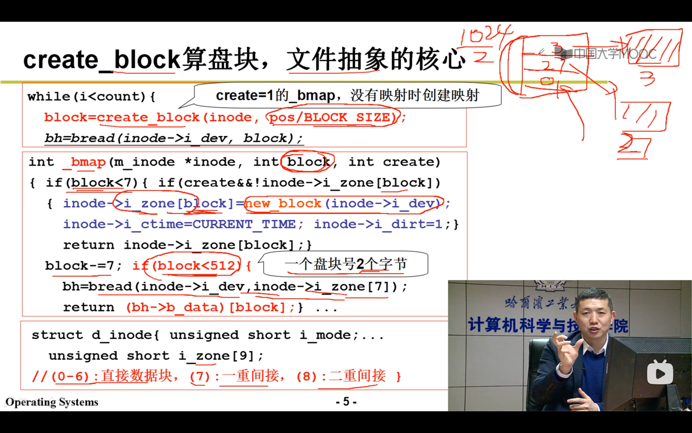

读写位置表示字符流位置，字符流位置除以块的大小，计算出字符在哪一段上， 根据段在查找映射表，
就可以找到对应的盘块号，一旦有了盘块号， 再用bread发出磁盘读写

fd = open("test.c")
read(fd)
fd, 文件描述符， 关键在于inode，

inode和FCB的关系

文件路径和inode的映射，
indoe找到盘块号，
根据盘块号往电梯队列里放，
根据电梯队列里的盘块号算出CHS,
最后根据out发在磁盘控制器上，
磁盘控制器驱动马达，电生磁，磁生电，实现数据的读写 

