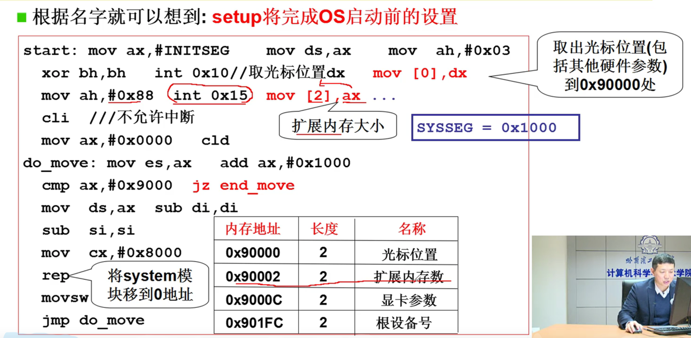
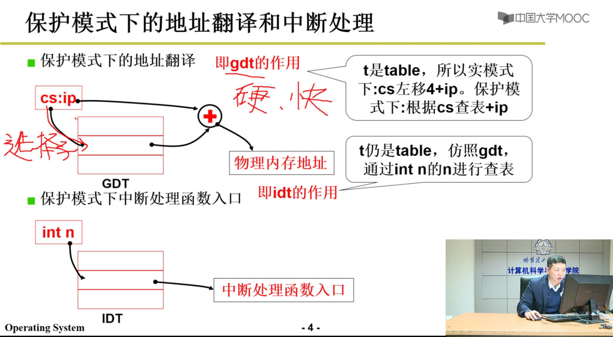
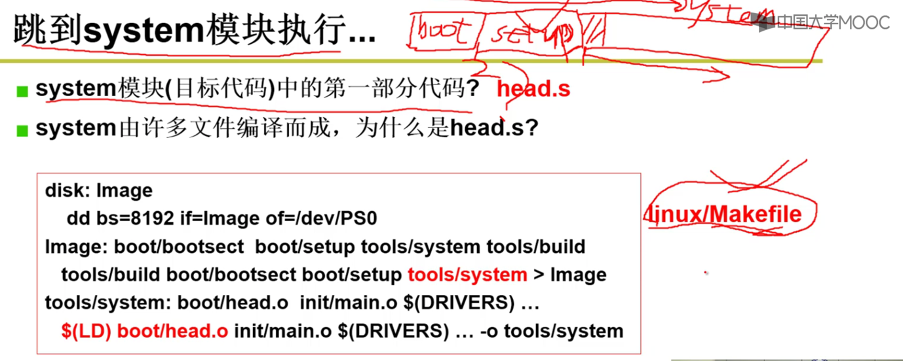
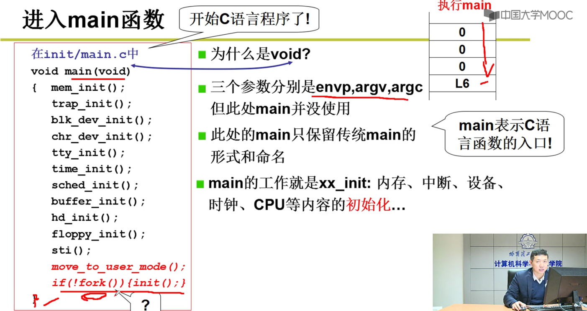
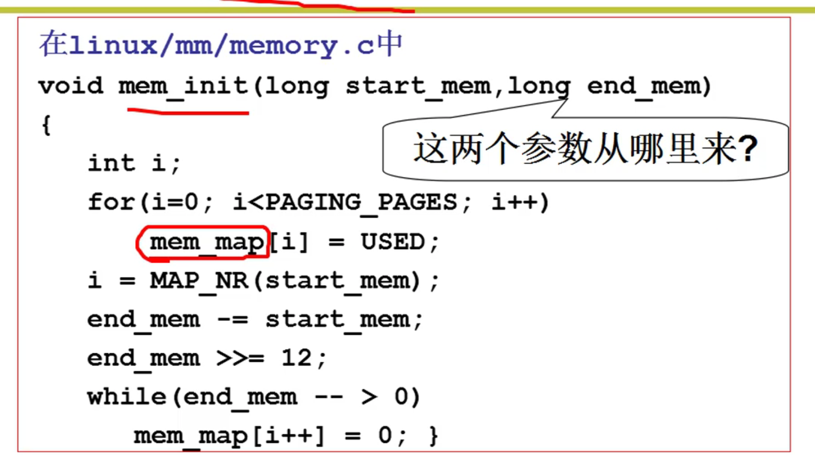

1.操作系统在硬盘上，开机启动后第一步工作是将操作系统从磁盘加载到内存；（引导扇区完成 bootsect.s完成）

2.setup模块
获取计算机的硬件信息，内存，显卡等信息；

ox15 获取内存大小，放入ax
扩展内存：1M以后的内存叫扩展内存；
中断： ；

32位系统，选择子，gdt表，全局描述符

system模块
第一部分代码 head.s
head.s执行完后跳到main.c

main.c
各种初始化

内存初始化
mem_map 记录内存的使用
1页 4k

