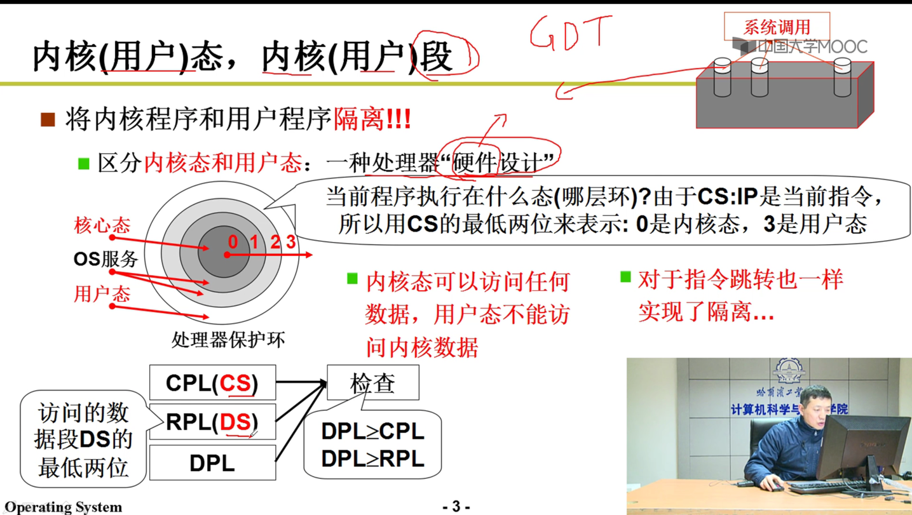
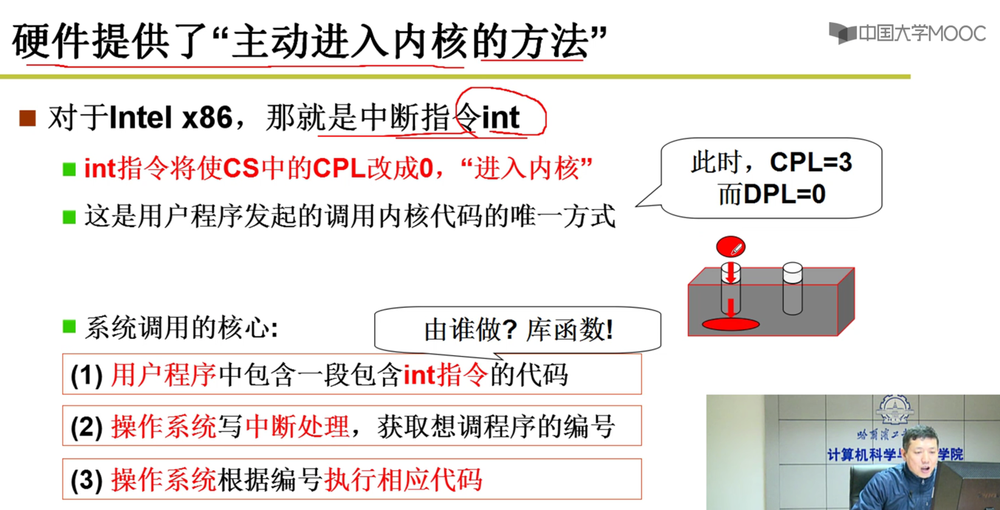
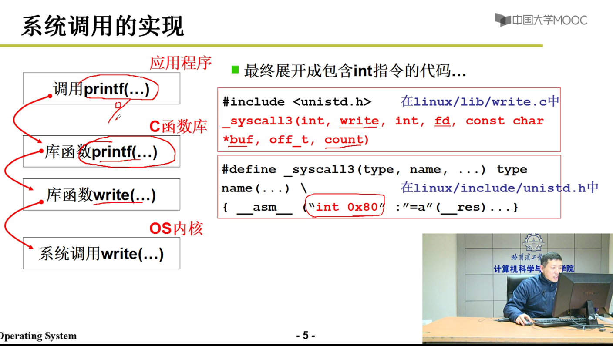
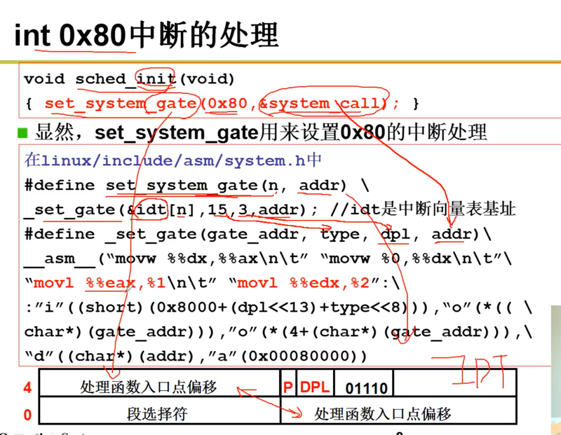

不能随意调用内核的函数；安全原因
cpl = 3, dpl = 0,即用户态的级别访问内核的内存，不允许

硬件设计： 内核态 用户态

进入内核的唯一方法：中断   int 0x80
CS:IP
CS = 8, IP = system_call
8对应的DPL=3

系统调用核心：
（1）用户程序中包含一段包含int指令的代码
    如调用write函数

（2）操作系统写中断处理，获取想调程序的编号
    如将write函数转换为int指令

（3）操作系统根据编号执行相应的代码
    int指令，查 IDT表，找到跳哪里
    如根据相应的int指令，执行对应的代码

系统调用的实现：

_sys_call_table+4*%eax.4