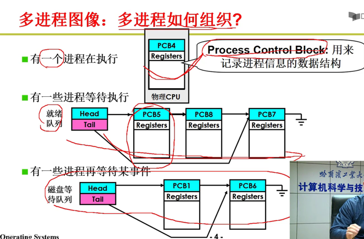
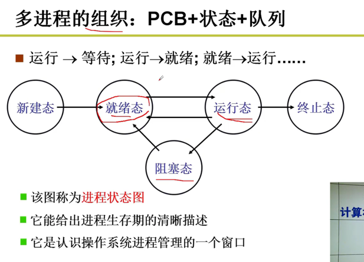
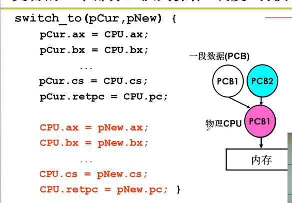
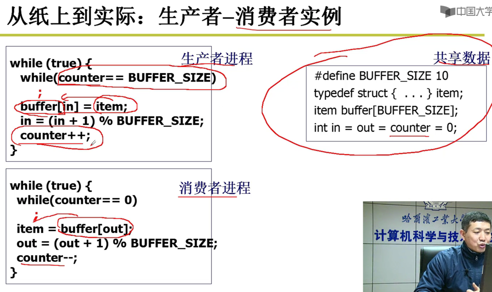
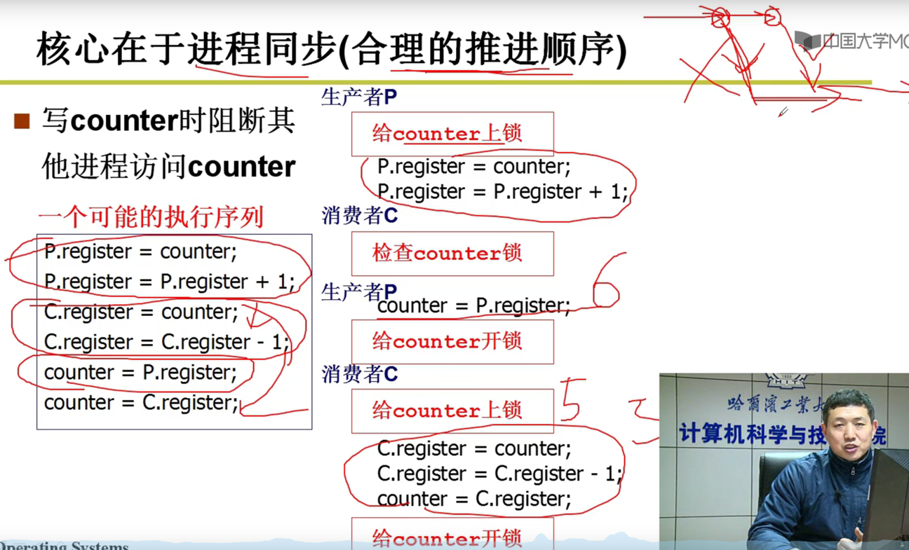
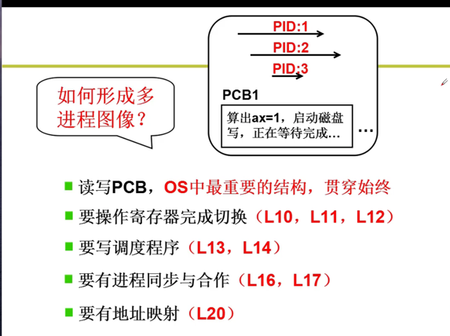

充分利用CPU

启动多个程序，交替执行；多进程推进
操作系统需要把这些进程记录好，按照合理的次序推进（分配资源，进行调度）

main中的fork（）创建了第1个进程，init执行了shell；shell再启动其它进程

if(!fork()){init();}

int main(int argc, char * argv[]){
 while(1){
    scanf("%s,cmd);
    if (!fork()){
        exec(cmd);
        wait();
    }
 }
}

多进程组织 
PCB + 状态 + 队列

PCB Process Control Block:
用来记录进程信息的数据结构

多个进程对应的PCB放在不同的队列：
运行态：一个进程正在执行；
就绪态： 就绪队列：万事具备，只欠CPU
阻塞态：磁盘等待队列：等待磁盘IO事件；  

多进程如何交替
调度，选择下一个进程，得到下一个进程的pcb；
然后根据cpu，将 CPU 的寄存器 和 存放在进程pcb中的信息，进行交换。

调度算法

交替的3个部分：  队列操作 + 调度 + 切换

进程调度
 FIFO：先来先服务；
 Priority：优先级策略；
 短作业优先；

切换进程
把cpu里数据保存到pcb里，
把物理cpu当前寄存器中的信息,保存到pcb的数据结构里对应的寄存器结构。

  
多进程相互影响
都是用户态的程序，如果能随意访问其它程序的内存空间，会出现很多问题。
解决：
内存管理：多进程的地址空间分离；

映射表
每个进程有自己的虚拟内存，通过内存映射表 ，会映射到物理内存的不同的位置。 

多进程合作
生产者 消费者模型
如果没有锁，导致的混乱

加锁模型

多进程图像

 

