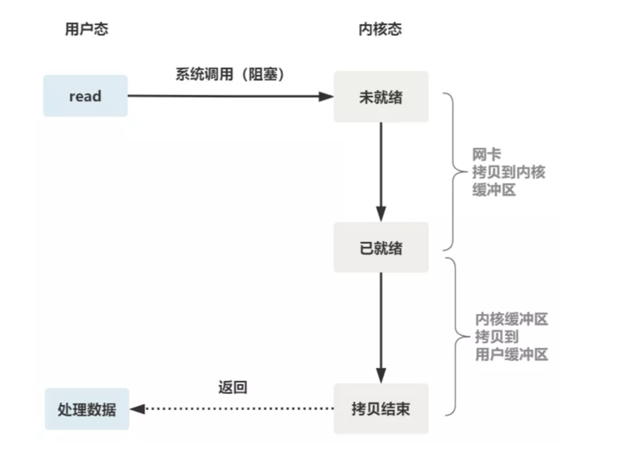
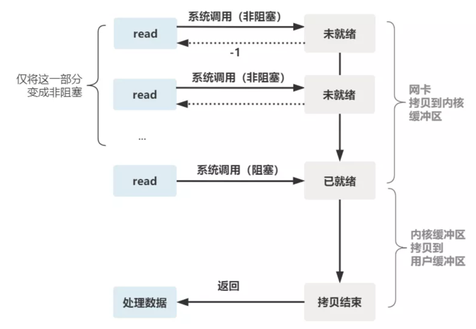

https://blog.csdn.net/u012588160/article/details/106003490

流：一个流可以是文件，socket，pipe等等可以进行I/O操作的内核对象。

read：从流中读取数据；

write：往流中写入数据；

阻塞：一直等待任务，有任务到来会被唤醒；

非阻塞忙轮询：一遍又一遍地询问有没有任务；

缓冲区：先把要获取或者写入的数据缓存起来，等到合适的时机再进行io操作。

阻塞IO：
    
    服务端：
    listenfd = socket();   // 打开一个网络通信端口
    bind(listenfd);        // 绑定
    listen(listenfd);      // 监听
    while(1) {
        connfd = accept(listenfd);  // 阻塞建立连接
        int n = read(connfd, buf);  // 阻塞读数据
        doSomeThing(buf);  // 利用读到的数据做些什么
        close(connfd);     // 关闭连接，循环等待下一个连接
    }

    服务端的线程阻塞在了两个地方，一个是 accept 函数，一个是 read 函数

    客户端：
    fd = socket()
    connect(fd)
    write(fd,buf)
    close(fd)

    （1）read：如果内核态缓冲区没有数据，那么将阻塞，如果内核态缓冲区从没有数据到有数据，就会唤醒阻塞的read线程；
    （2）write：如果内核态缓冲区满了，无法在写入，此时将阻塞，如果内核态缓冲区从满状态到非满状态，就会唤醒阻塞的write线程。

read函数细节：
    
    第一阶段：数据从网卡拷贝到内核缓冲区； 文件描述符读已就绪
    第二阶段：数据从内核拷贝到用户缓冲区buf；返回到达的字节数；

优化方式： 
每次都创建一个新的进程或线程，去调用 read 函数，并做业务处理。
这样，当给一个客户端建立好连接后，就可以立刻等待新的客户端连接，而不用阻塞在原客户端的 read 请求上。

    while(1) {
        connfd = accept(listenfd);  // 阻塞建立连接
        pthread_create（doWork);  // 创建一个新的线程
    }
    void doWork() {
        int n = read(connfd, buf);  // 阻塞读数据
        doSomeThing(buf);  // 利用读到的数据做些什么
        close(connfd);     // 关闭连接，循环等待下一个连接
    }

非阻塞 IO:

操作系统为我们提供一个非阻塞的 read 函数。
    
    非阻塞的 read，指的是在数据到达前，即数据还未到达网卡，或者到达网卡但还没有拷贝到内核缓冲区之前，这个阶段是非阻塞的。
    当数据已到达内核缓冲区，此时调用 read 函数仍然是阻塞的，需要等待数据从内核缓冲区拷贝到用户缓冲区，才能返回。

    这个 read 函数的效果是，如果没有数据到达时（到达网卡并拷贝到了内核缓冲区），立刻返回一个错误值（-1），而不是阻塞地等待。
    只需要在调用 read 前，将文件描述符设置为非阻塞即可。

    fcntl(connfd, F_SETFL, O_NONBLOCK);
    int n = read(connfd, buffer) != SUCCESS)

这样，就需要用户线程循环调用 read，直到返回值不为 -1，再开始处理业务。

IO多路复用：
多路复用有三个函数，最开始是 select，然后又发明了 poll 解决了 select 文件描述符的限制，然后又发明了 epoll 解决 select 的三个不足。

    select:
    select函数可以把一个文件描述符的数组发给操作系统， 让操作系统去遍历，确定哪个文件描述符可以读写， 然后告诉我们去处理：

    select系统调用阻塞，内核作遍历，无用户态到内核态的切换的开销；

select系统调用的函数定义如下：

    int select(
    int nfds,
    fd_set *readfds,
    fd_set *writefds,
    fd_set *exceptfds,
    struct timeval *timeout);
    // nfds:监控的文件描述符集里最大文件描述符加1
    // readfds：监控有读数据到达文件描述符集合，传入传出参数
    // writefds：监控写数据到达文件描述符集合，传入传出参数
    // exceptfds：监控异常发生达文件描述符集合, 传入传出参数
    // timeout：定时阻塞监控时间，3种情况
    //  1.NULL，永远等下去
    //  2.设置timeval，等待固定时间
    //  3.设置timeval里时间均为0，检查描述字后立即返回，轮询

服务端代码：
    
    首先一个线程不断接受客户端连接，并把 socket 文件描述符放到一个 list 里；

    while(1) {
        connfd = accept(listenfd);
        fcntl(connfd, F_SETFL, O_NONBLOCK);
        fdlist.add(connfd);
    }

    然后，另一个线程不再自己遍历，而是调用 select，将这批文件描述符 list 交给操作系统去遍历

    while(1) {
    // 把一堆文件描述符 list 传给 select 函数
    // 有已就绪的文件描述符就返回，nready 表示有多少个就绪的
    nready = select(list);
    ...
    }

    当 select 函数返回后，用户依然需要遍历刚刚提交给操作系统的 list。
    只不过，操作系统会将准备就绪的文件描述符做上标识，用户层将不会再有无意义的系统调用开销。

    while(1) {
        nready = select(list);
        // 用户层依然要遍历，只不过少了很多无效的系统调用
        for(fd <-- fdlist) {
            if(fd != -1) {
                // 只读已就绪的文件描述符
                read(fd, buf);
                // 总共只有 nready 个已就绪描述符，不用过多遍历
                if(--nready == 0) break;
            }
        }
    }

    
可以看出几个细节：

    1. select 调用需要传入 fd 数组，需要拷贝一份到内核，高并发场景下这样的拷贝消耗的资源是惊人的。（可优化为不复制）
    2. select 在内核层仍然是通过遍历的方式检查文件描述符的就绪状态，是个同步过程，只不过无系统调用切换上下文的开销。（内核层可优化为异步事件通知）
    3. select 仅仅返回可读文件描述符的个数，具体哪个可读还是要用户自己遍历。（可优化为只返回给用户就绪的文件描述符，无需用户做无效的遍历）

整个 select 的流程图如下。

POLL:
也是操作系统提供的系统调用函数，去掉了 select 只能监听 1024 个文件描述符的限制。

    int poll(struct pollfd *fds, nfds_tnfds, int timeout);
    
    struct pollfd {
        intfd; /*文件描述符*/
        shortevents; /*监控的事件*/
        shortrevents; /*监控事件中满足条件返回的事件*/
    };

EPOLL:
epoll 主要就是针对select的三个点进行了改进;

    1. 内核中保存一份文件描述符集合，无需用户每次都重新传入，只需告诉内核修改的部分即可。
    2.内核不再通过轮询的方式找到就绪的文件描述符，而是通过异步 IO 事件唤醒。
    3.内核仅会将有 IO 事件的文件描述符返回给用户，用户也无需遍历整个文件描述符集合。

    具体，操作系统提供了这三个函数。
    （1）建一个 epoll 句柄
    int epoll_create(int size);
    （2）向内核添加、修改或删除要监控的文件描述符
    int epoll_ctl(int epfd, int op, int fd, struct epoll_event *event);
     (3) 类似发起了 select() 调用
    int epoll_wait(int epfd, struct epoll_event *events, int max events, int timeout);

IO模型：

    （1）阻塞IO模型：就是一个线程只能处理一个IO操作，如果需要处理多个IO操作，就需要创建多个线程或者进程。
    （2）非阻塞忙轮询IO模型：轮询所有的流，如果可读取或写入，则执行，否则处理下一个流。 
          有两个缺点：1.在所有流都不可读取和写入的时候，会造成CPU空转，浪费系统资源；2.不能执行处理可读取或写入的流，需要遍历所有的流并进行判断是否可读取或写入，再进行处理；
    （3）select模型：对于上述的非阻塞忙轮询IO模型的CPU空转的缺点进行补充。
         引入一个select代理，用于检测所有流是否可读取和可写入，如果所有流都不可读取和写入，那么这个线程将阻塞，如果至少有一个流可读取或写入，那么就会将阻塞的线程唤醒。
         select模型下，维护一个fd_set数据结构（使用的是Bitmap位图算法），每一个元素与流关联，每次调用select()方法时，需要将这个数据结构拷贝到内核态，然后内核判断哪些流可读或可写，并写入到这个数据结构然后拷贝到用户态。
         因此，3个缺点： 1.如果数据结构太大，在用户态和内核态之间拷贝会很耗性能；2.在内核态中，每次都要遍历这个数据结构的所有元素，比较耗性能；3.为了减少拷贝对性能的损害，内核对这个集合的大小做了限制（1024，大小不可修改）；
    （4）poll模型：跟select模型类似，只是没有对fd_set数据结构集合的大小做限制，因此只解决了select模型的第三个缺点，第一、二个缺点依然存在；
    （5）epoll模型：该模型基于事件驱动的方式，使用一个文件描述符来管理多个描述符，描述符的数量没有限制。每当fd就绪，就会调用系统注册的回调函数，将fd加入到readyList中。进行IO操作的时候，只需要遍历这个readyList，而不需要遍历所有的fd。因此解决了CPU空转、遍历所有fd、大集合在用户态和内核态之间拷贝的性能消耗的缺点。

 	        select	                   poll	                epoll
    操作方式	  遍历	                     遍历	            回调
    底层实现	  数组	                     链表	            红黑树
    IO效率	线性遍历，时间复杂度为O(n)	时间复杂度为O(n)	        事件通知方式，每当fd就绪，系统注册的回调函数就会被调用，将就绪fd放到readyList里面，时间复杂度O(1)
    最大连接数	1024（x86）或2048（x64）	无上限	            无上限
    fd拷贝	每次调用select，都需要把fd集合从用户态拷贝到内核态	每次调用poll，都需要把fd集合从用户态拷贝到内核态	调用epoll_ctl时拷贝进内核并保存，之后每次epoll_wait不拷贝

