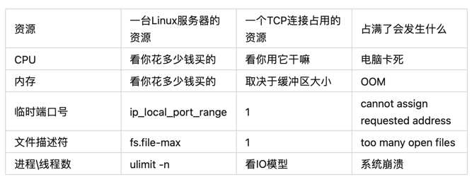

建立一个tcp连接，需要socket四元组，即：
源ip，源端口，目标ip，目标端口  

其中源端口是 操作系统分配的。

每建立一个连接就需要分配有一个文件描述符。

error: connect cannot assign requested address.

    端口号不够用。
    端口号是 16 位的，范围是 1~65535，Linux 对可使用的端口范围是有具体限制的，
    [root]# cat /proc/sys/net/ipv4/ip_local_port_range
    1024 65000    

    当前的限制是1024~65000，所以你就只能有63977个端口号可以使用。

可以 vim /etc/sysctl.conf 这个文件进行修改，我们在这个文件里添加一行记录

    net.ipv4.ip_local_port_range = 60000 60009
    保存好后执行 sysctl -p /etc/sysctl.conf 使其生效。这样你就只有 10 个端口号可以用了，就会更快报出端口号不够用的错误。

建立一个 TCP 连接，需要将通信两端的套接字（socket）进行绑定，
如下：源 IP 地址：源端口号 <---->  目标 IP 地址：目标端口号
只要这套绑定关系构成的四元组不重复即可，刚刚端口号不够用了，是因为我一直对同一个目标IP和端口建立连接，那我换一个目标端口号试试。

error:socket too many open files

    每建立一个TCP连接，操作系统就得分配给你一个文件描述符，linux 对可打开的文件描述符的数量分别作了三个方面的限制：
    系统级：当前系统可打开的最大数量，通过 cat /proc/sys/fs/file-max 查看；
    用户级：指定用户可打开的最大数量，通过 cat /etc/security/limits.conf 查看；
    进程级：单个进程可打开的最大数量，通过 cat /proc/sys/fs/nr_open 查看；

    [root ~]# cat /proc/sys/fs/file-max
    100000
    [root ~]# cat /proc/sys/fs/nr_open
    100000
    [root ~]# cat /etc/security/limits.conf
    ...
    * soft nproc 100000
    * hard nproc 100000

比如你想修改单个进程可打开的最大文件描述符限制为100，可以这样：echo 100 > /proc/sys/fs/nr_open

连接太多，响应慢：
    
    每建一个TCP连接都需要消耗一个线程来为你服务，几十万个线程不停地进行上下文切换，需要消耗更多的资源，使cpu更加忙碌；
    C10K问题，就是当服务器连接数达到 1 万且每个连接都需要消耗一个线程资源时，操作系统就会不停地忙于线程的上下文切换，最终导致系统崩溃；

每建一个TCP连接就创建一个线程的方式，是最传统的多线程并发模型，还支持 IO 多路复用的方式，简单说就是一个线程可以管理多个 TCP 连接的资源，这样你就可以用少量的线程来管理大量的 TCP 连接了。

IO多路复用：。

error: out of memory

内存溢出，每个TCP连接本身，以及这个连接所用到的缓冲区，都是需要占用一定内存的，现在内存已经被你占满了，不够用了，所以报了这个错.

    可通过kill其它无用的进程释放内存；

